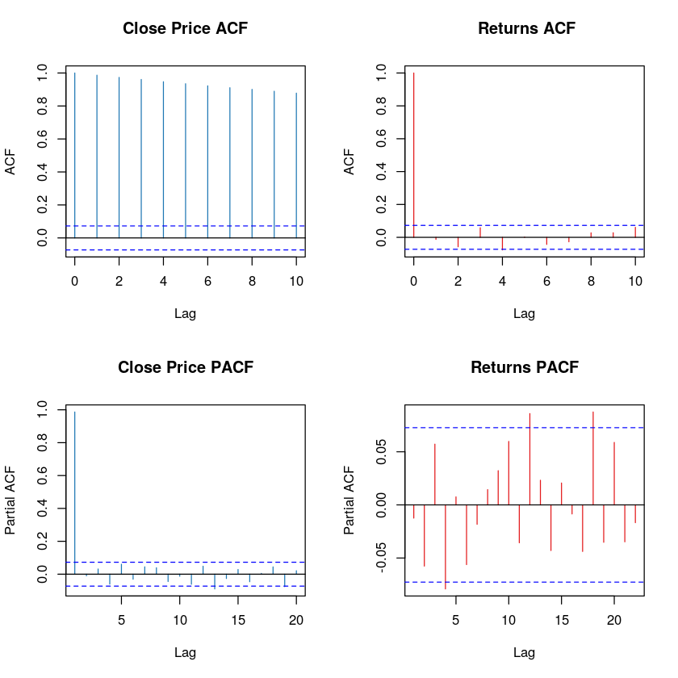
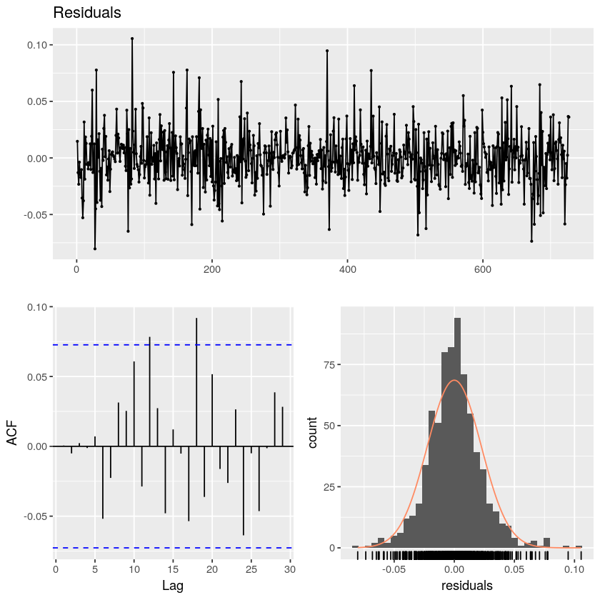
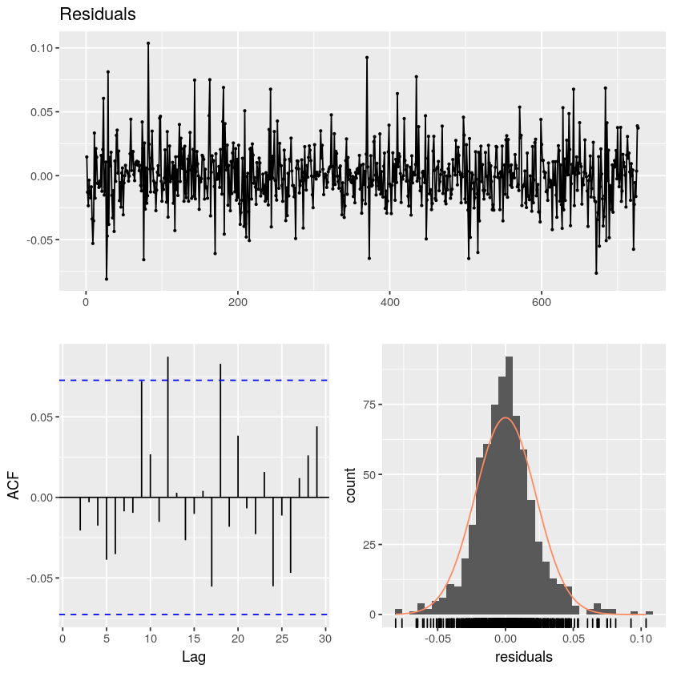
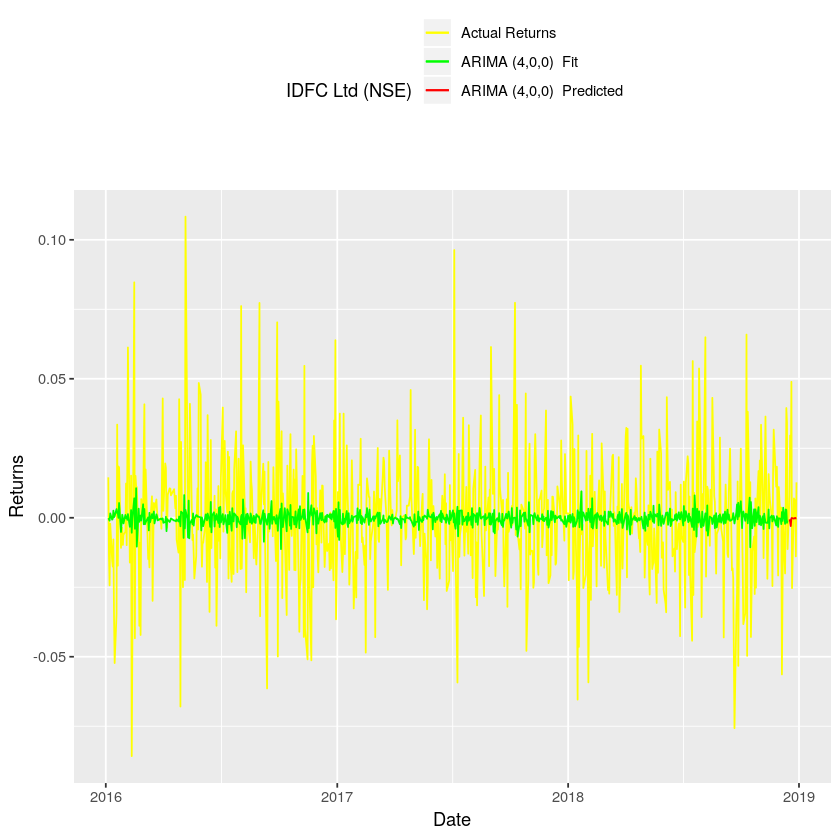
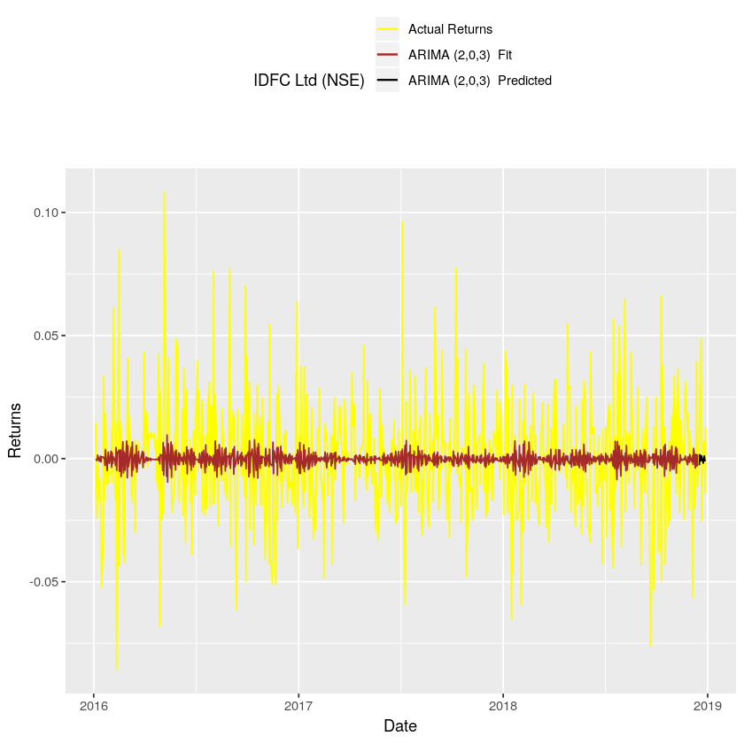
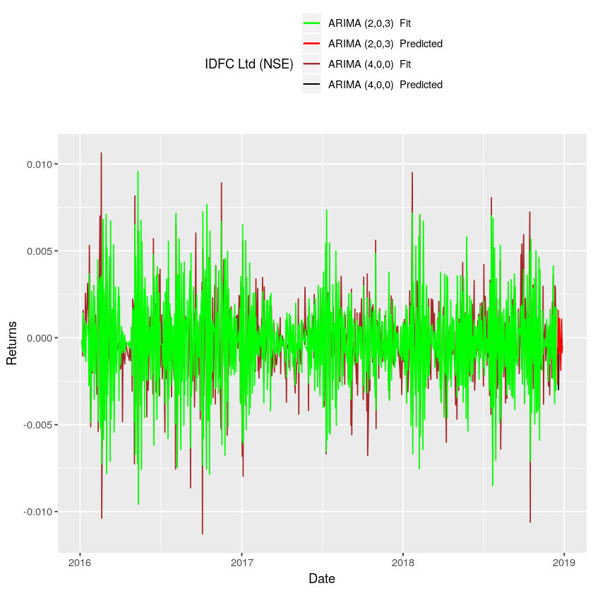
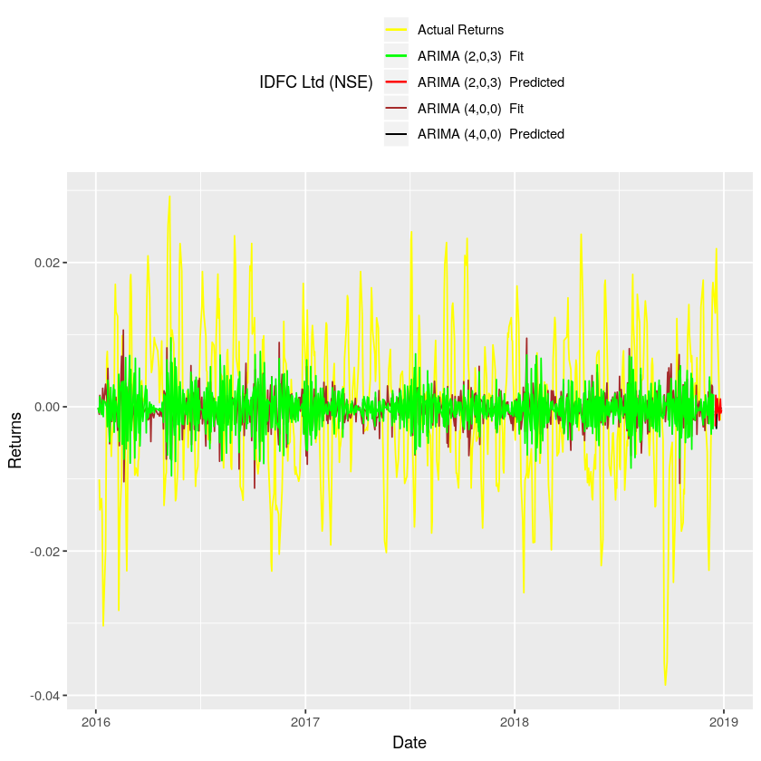

Using R to model daily returns in ARIMA.
========================================

Table of Contents {#table-of-contents .TOC-Heading}
=================

[List of Figures 3](#list-of-figures)

[List of Tables 3](#list-of-tables)

[Contribution 4](#contribution)

[Executive Summary 5](#executive-summary)

[Introduction 6](#introduction)

[Source of Data 6](#source-of-data)

[1. Data Cleaning 7](#data-cleaning)

[Exploratory Data Analysis (EDA) 8](#exploratory-data-analysis-eda)

[Finding series Kernel density and Box Plot:
9](#finding-series-kernel-density-and-box-plot)

[2. Starting Box-Jenkins modelling technique:
10](#starting-box-jenkins-modelling-technique)

[2.1 Stationarity check using scatter plot.
10](#stationarity-check-using-scatter-plot.)

[2.1 Conclusion 10](#conclusion)

[2.2 Stationarity Check by Augmented Dickey--Fuller Test
10](#stationarity-check-by-augmented-dickeyfuller-test)

[2.2 Conclusion 10](#conclusion-1)

[Part A: 11](#part-a)

[2.3.A. Finding AR and MA component: Visual Method
11](#a.-finding-ar-and-ma-component-visual-method)

[2.3.A. Conclusion 11](#a.-conclusion)

[2.4.A. Fitting model 11](#a.-fitting-model)

[2.5.A Method 1: Running Diagnostic checks on residuals: Visual Method
12](#a-method-1-running-diagnostic-checks-on-residuals-visual-method)

[2.5.A Method 1: Result and Conclusion
12](#a-method-1-result-and-conclusion)

[2.5.A Method 2 Running Diagnostic checks on residuals: Ljung--Box Test
13](#a-method-2-running-diagnostic-checks-on-residuals-ljungbox-test)

[Part B: 14](#part-b)

[2.3.B. Finding AR and MA component: Software recommendation (Auto
ARIMA)
14](#b.-finding-ar-and-ma-component-software-recommendation-auto-arima)

[2.4.B. Fitting the model: Attempt 2 -\> (2,0,3)
14](#b.-fitting-the-model-attempt-2---203)

[2.5.B Method 1: Running Diagnostic checks on residuals: Visual Method??
14](#b-method-1-running-diagnostic-checks-on-residuals-visual-method)

[2.5.B Method 1: Result and Conclusion
14](#b-method-1-result-and-conclusion)

[2.5.B Method 2 Running Diagnostic checks on residuals: Ljung--Box Test
15](#b-method-2-running-diagnostic-checks-on-residuals-ljungbox-test)

[2.5.1 Adding fitted values of model\_1 and model\_2 to data frame
15](#adding-fitted-values-of-model_1-and-model_2-to-data-frame)

[2.6 Making Predictions from test set.
16](#making-predictions-from-test-set.)

[3.A Plotting Model 1: ARIMA (4,0,0) 17](#a-plotting-model-1-arima-400)

[3.B Plotting Model 2: ARIMA (2,0,3) 18](#b-plotting-model-2-arima-203)

[3. (A, B) Plot: Model 1 vs Model 2 19](#a-b-plot-model-1-vs-model-2)

[3. Finding Model Accuracy 20](#finding-model-accuracy)

[4.1. MAE 20](#mae)

[4.1 Results: Accuracy by MAPE 20](#results-accuracy-by-mape)

[4.2 Results: Accuracy by MASE 20](#results-accuracy-by-mase)

[5 Conclusion 21](#conclusion-2)

List of Figures
===============

[Figure 1: Kernel Density and Box plot of Returns and Closing Price
9](#_Toc7938078)

[Figure 2: Scatterplot of Close price. 10](#_Toc7938079)

[Figure 3: Scatterplot of Close price. 10](#_Toc7938080)

[Figure 4: ACF and PACF plots of Close price and Returns.
11](#_Toc7938081)

[Figure 5: Model 1 ARIMA (4,0,0) residuals diagnostic checks.
12](#_Toc7938082)

[Figure 6:Model 2 ARIMA (2,0,3) residuals diagnostic checks.
14](#_Toc7938083)

[Figure 7: ARIMA (4,0,0) Actual Returns vs Fitted and Predicted Returns.
17](#_Toc7938084)

[Figure 8:ARIMA (2,0,3) Actual Returns vs Fitted and Predicted Returns.
18](#_Toc7938085)

[Figure 9: ARIMA (4,0,0) vs ARIMA (2,0,3) Fitted and Predicted Returns.
19](#_Toc7938086)

[Figure 10: Moving Average Returns vs ARIMA (4,0,0) & ARIMA (2,0,3)
Fitted and Predicted Returns. 21](#_Toc7938087)

List of Tables
==============

[Table 1: Downloaded Stock Data 7](#_Toc7938073)

[Table 2: Data frame with Close price and Returns only 7](#_Toc7938074)

[Table 3: Data frame with returns added 7](#_Toc7938075)

[Table 4: Data frame with fitted values of Model 1 and Model 2
15](#_Toc7938076)

[Table 5: Final Data frame with Predicted values. 16](#_Toc7938077)

Contribution
============

1.  Ishan Gupta List of figures, tables and Stationarity checks.

2.  Sagar Rathi R script and Data interpretation

3.  Sharad Khandelwal Table of contents and Diagnostic test.

4.  Vaisakh Mahapatra All visual graphing and Data frame Merging.

Executive Summary
=================

We all want to earn money from trading stocks, it requires only a
computer terminal and small amount of money i.e. least investment. But
still almost most of the trader lose money. This study tries to identify
why market are so efficient that it is so hard to earn money.

Introduction
============

In this project we take 3 years of daily closing data of IDFC Ltd and
try to identify any suitable ARIMA model which can predict the future
prices with list amount of error.

We attempt both the visual and mathematical model at all stages of ARIMA
modelling to allow user question each of our steps.

This article is written in form of story and can be easily read from
HTML file accompanied along with file. And we highly recommend our
readers to read them.

Source of Data
==============

The dataset for our project was sourced from Yahoo Finance for IDFC Ltd
with Max filter.

Dataset Download Link:
[*[https://query1.finance.yahoo.com/v7/finance/download/IDFC.NS?period1=1123785000&period2=1556908200&interval=1d&events=history&crumb=CGzvdgwaSMD]{.underline}*](https://query1.finance.yahoo.com/v7/finance/download/IDFC.NS?period1=1123785000&period2=1556908200&interval=1d&events=history&crumb=CGzvdgwaSMD)

Data Cleaning
=============

Before diving into our research, we first find the head of our data
(first 5 rows). Which looks like table given below. We have picked up
data from 2016 to 2018 only. Thus, removing other rows in the process.

[]{#_Toc7938073 .anchor}Table 1: Downloaded Stock Data

         Date         Open    High    Low     Close   Adj.Close   Volume
  ------ ------------ ------- ------- ------- ------- ----------- ---------
  3299   20-12-2018   41.60   44.95   41.30   44.00   44.00       7724128
  3300   21-12-2018   44.25   44.50   42.65   42.90   42.90       4509452
  3301   24-12-2018   42.90   43.90   42.30   43.20   43.20       3047812
  3302   26-12-2018   43.15   43.65   42.00   43.45   43.45       3437635
  3303   27-12-2018   43.50   44.05   42.50   42.85   42.85       4107116
  3304   28-12-2018   43.40   43.75   42.90   43.40   43.40       3433418

From this we can easily see that we have 7 columns, but we are concerned
only with Date and Close columns. Thus, we remove the rest of the
columns.

[]{#_Toc7938074 .anchor}Table 2: Data frame with Close price and Returns
only

         Date    Close
  ------ ------- -------
  2567   42373   47.8
  2568   42374   48.5
  2569   42375   47.85
  2570   42376   46.7
  2571   42377   46.6
  2572   42380   45.9

Our next attempt is to find the daily log returns, which will the final
transformation of data, after all we are concerned with only returns.

[]{#_Toc7938075 .anchor}Table 3: Data frame with returns added

         Date    Close   Returns
  ------ ------- ------- ----------
  2567   42373   47.8    NA
  2568   42374   48.5    0.014538
  2569   42375   47.85   -0.01349
  2570   42376   46.7    -0.02433
  2571   42377   46.6    -0.00214
  2572   42380   45.9    -0.01514

Now we will split data into train and test data. Our code can easily be
customized to set number of test data set by specifying value to
variable "delta."

We have set "delta" =10, thus will make prediction for 10 days.

Exploratory Data Analysis (EDA)
===============================

The beauty of ARIMA modelling is that it can be performed by both visual
and mathematical approach.

Thus, later in this report will come across both visual and mathematical
approach for all the procedures.

The purpose is not to lengthen report, but because both models produces
different models. It is as if they are mutually exclusive.

Finding series Kernel density and Box Plot:
-------------------------------------------

[]{#_Toc7938078 .anchor}Figure 1: Kernel Density and Box plot of Returns
and Closing Price

{width="6.268055555555556in"
height="6.268055555555556in"}

It seems that while returns have 3 peaks returns have only one peak.
Also, while price have no outliers, returns have many outliers, which is
quite normal for stock returns.

Starting Box-Jenkins modelling technique:
=========================================

2.1 Stationarity check using scatter plot.
------------------------------------------

[]{#_Toc7938079 .anchor}Figure 2: Scatterplot of Close price.

{width="2.9694444444444446in"
height="2.9694444444444446in"}{width="2.9770833333333333in"
height="2.9770833333333333in"}

[]{#_Toc7938080 .anchor}Figure 3: Scatterplot of Close price.

2.1 Conclusion
--------------

From above plots we come to know that returns are stationary while
closing price are not.

Hence, we eliminate Closing price from our study.

2.2 Stationarity Check by Augmented Dickey--Fuller Test
-------------------------------------------------------

ADF test is used to check stationarity of model with:

H0: Series is not stationary

H1: Series is stationary

2.2 Conclusion
--------------

The p-value obtained is 0.01 which is less than 0.05 and hence we can
reject the null hypothesis. Thus, our alternate Hypostasis prevails: H1:
Series is stationary

Part A:
-------

2.3.A. Finding AR and MA component: Visual Method
-------------------------------------------------

[]{#_Toc7938081 .anchor}Figure 4: ACF and PACF plots of Close price and
Returns.

{width="5.833333333333333in"
height="5.833333333333333in"}

2.3.A. Conclusion
-----------------

PACF crosses line at 4^th^ lag of returns hence our AR value is 04. ACF
does not crosses the line, hence MA: 0

Hence our model 1 is of type ARIMA (4,0,0)

2.4.A. Fitting model
--------------------

We now pass the training set to model with the specified order.

2.5.A Method 1: Running Diagnostic checks on residuals: Visual Method
---------------------------------------------------------------------

Now we derive the residuals from model 1 and plot diagnostic plot.

[]{#_Toc7938082 .anchor}Figure 5: Model 1 ARIMA (4,0,0) residuals
diagnostic checks.

{width="5.833333333333333in"
height="5.833333333333333in"}

2.5.A Method 1: Result and Conclusion
-------------------------------------

Our residuals are normally distributed, with limits -0.5 and +0.5 and
ACF plot of lagged values of residuals are not correlated for at least
8^th^ lag. Also, residuals are stationary and thus we do not find any
unaccounted correlation of lagged residuals in data.

2.5.A Method 2 Running Diagnostic checks on residuals: Ljung--Box Test
----------------------------------------------------------------------

Ljung-Box test is used to find if the series has any autocorrelation:

H0: Series do not have Auto Correlation.

H1: Series have Auto Correlation.

    On getting p value of 0.9876 we fail to reject our null hypothesis that residuals do not have autocorreation, hence we proceed to predict with the model. 

***But we can also find the ARIMA model using a mathematical way using
Auto ARIMA, so in next part we will derive another model and carry same
diagnostic test on them.***

Part B:
-------

2.3.B. Finding AR and MA component: Software recommendation (Auto ARIMA)
------------------------------------------------------------------------

Auto ARIMA suggest us to use (0,0,0) model

2.4.B. Fitting the model: Attempt 2 -\> (2,0,3)
-----------------------------------------------

We save the residuals to run diagnostic checks for the next

2.5.B Method 1: Running Diagnostic checks on residuals: Visual Method??
-----------------------------------------------------------------------

[]{#_Toc7938083 .anchor}Figure 6:Model 2 ARIMA (2,0,3) residuals
diagnostic checks.

{width="5.833333333333333in"
height="5.833333333333333in"}

2.5.B Method 1: Result and Conclusion
-------------------------------------

Inspire of normality of residuals, our residuals have some auto
correlation as can be seen from ACF plot, to verify mathematically we
perform Ljung--Box Test.

2.5.B Method 2 Running Diagnostic checks on residuals: Ljung--Box Test
----------------------------------------------------------------------

    P value of 0.9572 suggest that we series do not have auto correlation hence we proceed  to predict the with the model.

2.5.1 Adding fitted values of model\_1 and model\_2 to data frame
-----------------------------------------------------------------

We need to plot and fitted and predicted values, so we start by adding
fitted values of both models back to data frame as columns as seen
below.

[]{#_Toc7938076 .anchor}Table 4: Data frame with fitted values of Model
1 and Model 2

  Date    Close   Returns    fit\_1     fit\_2
  ------- ------- ---------- ---------- ----------
  42374   48.5    0.014538   -0.00015   -0.00012
  42375   47.85   -0.01349   -0.00051   -0.00054
  42376   46.7    -0.02433   -0.00104   -0.00082
  42377   46.6    -0.00214   0.001572   0.001402
  42380   45.9    -0.01514   -0.00067   -0.00107
  42381   45.1    -0.01758   -0.00035   -0.00016

2.6 Making Predictions from test set.
-------------------------------------

Since we will be plotting predicted values too, hence we append them
back to our data frame. Our new data frame looks as following:

[]{#_Toc7938077 .anchor}Table 5: Final Data frame with Predicted values.

  Date    Close   Returns    fit\_1     fit\_2
  ------- ------- ---------- ---------- ----------
  43448   39.65   -0.01129   -0.00099   0.001729
  43451   39.95   0.007538   -0.00058   -0.0027
  43452   41.15   0.029595   -0.00141   0.001592
  43453   41.9    0.018062   -0.00299   -0.00094
  43454   44      0.048904   -0.00012   -0.00075
  43455   42.9    -0.02532   -0.00012   0.001115

3.A Plotting Model 1: ARIMA (4,0,0)
===================================

[]{#_Toc7938084 .anchor}Figure 7: ARIMA (4,0,0) Actual Returns vs Fitted
and Predicted Returns.

{width="5.833333333333333in"
height="5.833333333333333in"}

We notice that model 1: ARIMA (4,0,0) is very far away from predicting
our stocks returns, it seems that most of the spikes are all unaccounted
for in the model.

3.B Plotting Model 2: ARIMA (2,0,3)
===================================

[]{#_Toc7938085 .anchor}Figure 8:ARIMA (2,0,3) Actual Returns vs Fitted
and Predicted Returns.

{width="5.833333333333333in"
height="5.833333333333333in"}

We notice that ARIMA(2,0,3) is very far away from predicting our stocks
returns, it seems that most of the spikes are all unaccounted for in the
model.

3. (A, B) Plot: Model 1 vs Model 2
==================================

[]{#_Toc7938086 .anchor}Figure 9: ARIMA (4,0,0) vs ARIMA (2,0,3) Fitted
and Predicted Returns.

{width="5.833333333333333in"
height="5.833333333333333in"}

It seems that both model 1 ARIMA (4,0,0) and model 2 ARIMA(2,0,3) are
almost same and have similar prediction.

Finding Model Accuracy
======================

From above plots we are confused as both models predict almost similar
values as can be seen from the graph and both of this model are far away
from predicting the model. So, we wanted to know the accuracy of the two
model which will also tell the difference between them.

There are 4 methods available to find model accuracy:

4.1. MAE
--------

$\frac{1}{n}\sum_{n}^{t = 1}{}A_{t} - F_{t} \vee$

Which we reject as they do not consider the effect of magnitude of data.
And our MAE value will always be very small as day-to-day returns are
very small.

This will always understate our model errors.

##### 4.2. RMSE

$\sqrt{\frac{\sum_{}^{}\left| A_{t} - F_{t} \right|^{2}}{n}}$

Which we reject as they do not consider the effect of magnitude of data.
And our RMSE value will always be very small as day-to-day returns are
very small.

This will always understate our model errors.

##### 4.3. MAPE

$\left\{ \frac{1}{n}\sum\frac{\left| A_{t} - F_{t} \right|}{\left| A_{t} \right|} \right\} x100$

We accept MAPE as it takes the percentage difference hence eliminating
the scaling effect of MAE ad RMSE.

##### 4. MASE

$\frac{\text{MAE}}{\text{MA}E_{\text{NaiveModel}}}$

We also we compare our model with the NAIVE method, this tells us
whether all our Hard work performing the ARMIA can be just be performed
better by NAIVE method's value greater than one will suggest that our
ARIMA modeling was useless and vice versa.

4.1 Results: Accuracy by MAPE
-----------------------------

    ARIMA (4,0,0): 102.55"
    ARIMA (2,0,3): 106.24"

4.2 Results: Accuracy by MASE
-----------------------------

`ARIMA (4,0,0): 0.7`

`ARIMA (2,0,3): 0.71`

5 Conclusion
============

From MAPE value we can conclude that error percentage of model is 102%
hence the predictions are of no use if want to invest IDFC Ltd using our
model to predict data. But, despite having 102% error, our model was
better than NAIVE approach, as can be seen from MASE value less than 1.

Also, both of our model had different MAPE value producing a winner
which was model 1 ARIMA (4,0,0) with MAPE value was 3.69% lower than
MODEL 2 ARIMA (2,0,3). It seems we cannot trust Auto ARIMA or
mathematical manner of detecting parameters. We argued in our report
earlier that Visual methods are mutually exclusive, and hence should be
not be ignored and here we have a concrete proof of it.

Since we argued that spikes of data were unaccounted for, hence we plot
a Moving average of returns for 4 days and replot fitted and predicted
values of both model.

[]{#_Toc7938087 .anchor}Figure 10: Moving Average Returns vs ARIMA
(4,0,0) & ARIMA (2,0,3) Fitted and Predicted Returns.

{width="3.384027777777778in"
height="3.634027777777778in"}

It Can be clearly noticed that our argument that spikes of data were
unaccounted for can be clearly seen, as by taking moving average and
removing skis in data, we notice that both the model is overlapping
returns. Hence this model is weak in accounting the spikes in data.
