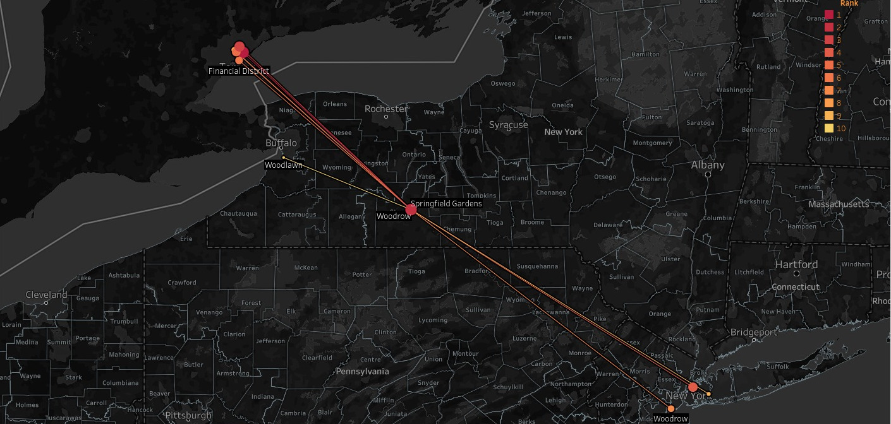
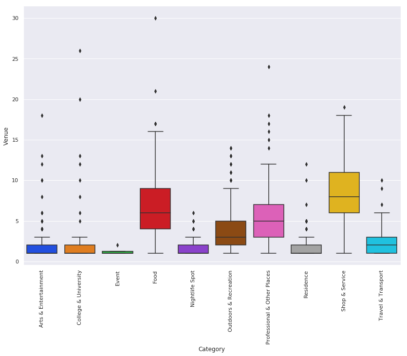
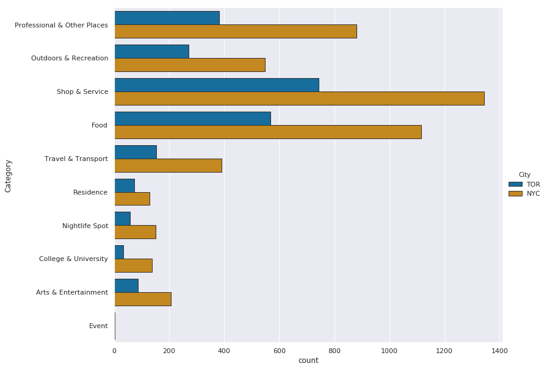
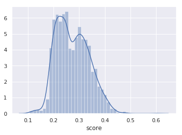

COURSE: Coursera IBM Data Science Professional Certification

**Finding Similar Neighbourhood to Migrate.**

A Simple inter-city or intra-city Recommender System

{width="6.5in"
height="4.1666666666666664e-2in"}{width="6.692708880139983in"
height="4.7832064741907265in"}

Github link:
[[https://github.com/sagarrathi/Coursera\_Capstone/blob/master/Capstone/Finding%20Similar%20Cities%20to%20Migrate.ipynb]{.underline}](https://github.com/sagarrathi/Coursera_Capstone/blob/master/Capstone/Finding%20Similar%20Cities%20to%20Migrate.ipynb)

Tableau Dashboard:
[[https://sagarrathi.github.io]{.underline}](https://sagarrathi.github.io/)

Table Of Contents
=================

**[Table Of Contents](#table-of-contents) 2**

**[1. Introduction](#introduction) 3**

> [1.1. Background](#background) 3
>
> [1.2. Problem](#problem) 3
>
> [1.3. Target Audience](#target-audience) 3

**[2. Data](#data) 4**

> [2.1. What data do we need?](#what-data-do-we-need) 4
>
> [2.1.1. Scraping neighbourhood and borough details from Wiki & other
> websites](#scraping-neighbourhood-and-borough-details-from-wiki-other-websites)
> 5
>
> [2.1.2. Getting Location Data OpenStreetMap API
> Nominatim](#getting-location-data-openstreetmap-api-nominatim) 6
>
> [2.2. Preprocessing Data for
> modelling](#preprocessing-data-for-modelling) 7
>
> [2.2.1. Removing rows with empty
> cells](#removing-rows-with-empty-cells) 7
>
> [2.2.2. Converting Category column to one-hot
> encoding](#converting-category-column-to-one-hot-encoding) 7
>
> [2.3. Describing Data](#describing-data) 9
>
> [2.3.1. Describing data\'s X](#describing-datas-x) 9
>
> [2.3.2. Describing data\'s y](#describing-datas-y) 9

**[3. Methodology](#section-1) 10**

> [3.1 Exploratory Data Analysis](#exploratory-data-analysis) 10
>
> [3.1.1 Finding correlation between feature
> sets](#finding-correlation-between-feature-sets) 10
>
> [3.1.2 Finding box plot of Data's X](#finding-boxplot-of-datas-x) 11
>
> [3.1.3 City wise number of venues](#city-wise-number-of-venues) 12
>
> [3.1.4 City wise venus\'s
> composition.](#city-wise-venuss-composition.) 13
>
> [3.2 Choosing Technique](#choosing-technique) 14
>
> [3.3 Applying Technique](#applying-technique) 14
>
> [3.2.1 Normalization](#normalization) 14
>
> [3.2.2 Multiplication](#multiplication) 14
>
> [3.2.3 Finding top 10 Recommendation](#finding-top-10-recommendation)
> 14

**[4. Result](#result) 15**

**[5. Discussion](#discussion) 17**

**[6. Conclusion](#conclusion) 18**

1. Introduction
===============

1.1. Background
---------------

We all love Spotify or many of us do. Spotify has offices in New York
(USA) and Toronto (Canada).

Suppose the company decides to shuffle some of its employees between two
cities, and James(employee) of NYC and Thomas(employee) of Toronto are
being told exchange themselves between offices in lieu of pay rise.

Both James and Thomas agree to exchange for the benefit of a pay rise.

1.2. Problem
------------

The problem is that both are very stubborn people. They think that they
will be able to find the most similar environment in both of these
cities.

After doing hard research they fail and they give up the task of
exchanging places. So the HR of the company has asked us to solve this
problem or to find suitable (similar) alternate neighbourhood between
these two cities.

We ask HR, what does he/she mean by similar neighbourhood?

The HR told us that they need similar cities on the basis of leaving
condition and amenities present in the surrounding area.

So, our task here is to find similar neighbourhood in and outside of the
city and give recommendation to HR so that the next time they do some
shuffling at least they will have data and can recommend a suitable
neighbourhood to the employee.

1.3. Target Audience 
---------------------

Our target audience is various HR who want to send their employees to
different cities and also various people who want to shift cities and do
not know where to go being very stubborn of choices.

2. Data
=======

2.1. What data do we need?
--------------------------

Our problem statement has made a very vague suggestion on similar
cities. What data we need in this project can be listed by asking right
questions.........\... and answering them too.

  No.   Questions                                                                                                                   Answers
  ----- --------------------------------------------------------------------------------------------------------------------------- ---------------------------------------------------------------------------------------------------------------------------------------------------------------------------------------------------------------------------------------------------------------------------------
  1     Do you know the name of the neighbourhood and boroughs of cities?                                                           We do not know yet but Wikipedia and other websites have published all of this data, so we will scrape that data.
  2     Before obtaining any data on amenities around do you know the exact GPS coordinates of those places?                        We don't remember GPS coordinate of own home but in this case, Open Street Map and Google Map know all about this data, so we will use their API (geopy) to solve this problem.
  3     Ok great that you know GPS coordinate but do know what paces are nearby that location like garden, parks, hotels and etc.   To be honest, I am a couch potato, I don't know the name of the restaurant nearby my neighbour but I often use the Foursquare app to explore any place, I heard that they have API too and we can get a large amount of data from those API. So we will use the foursquare API.

It seems that we have answers for all our data retrieval needs. Let us
try those answers and see what we get.

### 2.1.1. Scraping neighbourhood and borough details from Wiki & other websites

For Toronto we obtain 174 data points with the format as follows:

      **Neighbourhoods**   **Boroughs**          **City**
  --- -------------------- --------------------- ----------
  0   Agincourt            Scarborough           TOR
  1   Alderwood            Etobicoke             TOR
  2   Alexandra Park       Old City of Toronto   TOR
  3   Allenby              Old City of Toronto   TOR
  4   Amesbury             North York            TOR

For New York we obtain 329 data points with the format as follows:

      **Neighborhoods**   **Boroughs**    **City**
  --- ------------------- --------------- ----------
  0   Bath Beach          Brooklyn        NYC
  1   Allerton            Bronx           NYC
  2   Battery Park City   Manhattan       NYC
  3   Arverne             Queens          NYC
  4   Annadale            Staten Island   NYC

We merge these two data set to obtain a common data frame. And continue
to obtain GPS coordinates of each location(neighbourhood).

### 2.1.2. Getting Location Data OpenStreetMap API Nominatim

Here we use geopy library of python to search for latitude and longitude
of each neighbourhood. This data is necessary for further retrieving
data from foursquare. We obtain the following data:

                    Neighbourhoods                              Boroughs                              City        Latitude                          Longitude
  ----------------- ------------------------------------------- ------------------------------------- ----------- --------------------------------- ---------------------------------
  0                 Bath Beach                                  Brooklyn                              NYC         40.6018495                        -74.000501
  1                 Allerton                                    Bronx                                 NYC         40.8661111                        -73.8505556
  2                 Battery Park City                           Manhattan                             NYC         40.7110166                        -74.0169369
  3                 Arverne                                     Queens                                NYC         40.5934173                        -73.7895462
  \-\-\-\-\-\-\--   \-\-\-\-\-\-\-\-\-\-\-\-\-\-\-\-\-\-\-\--   \-\-\-\-\-\-\-\-\-\-\-\-\-\-\-\-\--   \-\-\-\--   \-\-\-\-\-\-\-\-\-\-\-\-\-\-\--   \-\-\-\-\-\-\-\-\-\-\-\-\-\-\--
  163               Westminster                                 North York                            TOR         41.1970392                        -73.8451355
  164               Westmount                                   Etobicoke                             TOR         40.5731606                        -74.094586
  165               Weston                                      York                                  TOR         42.7684005                        -75.7365767
  166               Wexford                                     Scarborough                           TOR                                           
  167               Willowdale                                  North York                            TOR                                           -73.469407

2.2. Preprocessing Data for modelling
-------------------------------------

### 2.2.1. Removing rows with empty cells

Empty cells in GPS coordinates of the neighbourhood will not render in
the map so we will delete such cell.

Also, cells without a category will be useless for classification so
must be deleted too.

On command: df.isnull().sum() we get:

-   Neighborhoods 0

-   Boroughs 0

-   City 0

-   Latitude 0

-   Longitude 0

-   Venue 0

-   Category 0

-   VenueLat 0

-   VenueLong 0

Hence no incomplete rows.

### 2.2.2 Reducing number of categories or features set.

We have 477 categories which is very large and redundant.

One way to solve this issue is to push up the child categories to parent
categories as this will reduce the number of categories we have to deal
with.

We do this by finding the categories structure from foursquare which
looks like below:

Arts & Entertainment

\|-\> Amphitheater

\|-\> Movie Theater

\|-\> Drive-in Theater

\|-\> Indie Movie Theater

We have 5 levels of category so we start by converting level 5 category
to level and level 4 to level 3 and so on.

On Converting level: 5 to 4 we obtain no change.

On Converting level: 4 to 3 we reduce category by 18.

On Converting level: 3 to 2 we reduce category by 121.

On Converting level: 2 to 1 we reduce category by 293.

And thus we convert 477 categories to mere 10 major categories.

### 2.2.3. Converting Category column to one-hot encoding

Since we would like to know the number of times each category occurred
in the neighborhood we will convert category column to one-hot encoded
columns.

      **Neighborhoods**   **Boroughs**   **City**   **Latitude**   **Longitude**   **Venue**         **VenueLat**   **VenueLong**   **Arts & Entertainment**   **College & University**   **Event**   **Food**   **Nightlife Spot**   **\-\-\-\--**   **Residence**   **Shop & Service**
  --- ------------------- -------------- ---------- -------------- --------------- ----------------- -------------- --------------- -------------------------- -------------------------- ----------- ---------- -------------------- --------------- --------------- --------------------
  0   East New York       Brooklyn       NYC        40.66677       -73.882358      D\'compadres      40.666623      -73.882174      0                          0                          0           0          0                    **\-\-\-\--**   0               1
  1   East New York       Brooklyn       NYC        40.66677       -73.882358      Torres Hardware   40.666584      -73.882608      0                          0                          0           0          0                    **\-\-\-\--**   0               1

Now we group data by neighbourhoods and calculate the mean of their
categories to obtain the ratio of presence of a particular category in a
Neighbourhood. We further remove other columns to obtain what we call as
features or X.

      **Neighborhoods**   **City**   **Latitude**   **Longitude**   **VenueLat**   **VenueLong**   **Arts & Entertainment**   **College & University**
  --- ------------------- ---------- -------------- --------------- -------------- --------------- -------------------------- --------------------------
  0   Agincourt           TOR        43.785353      -79.278549      43.787123      -79.274425      0.033333                   0
  1   Alderwood           TOR        43.601717      -79.545232      43.601361      -79.545082      0.033333                   0
  2   Alexandra Park      TOR        43.650758      -79.404298      43.651561      -79.404832      0                          0

X:

         **Arts & Entertainment**   **College & University**   **Event**   **Food**   **Nightlife Spot**   **Outdoors & Recreation**   **Professional & Other Places**   **Residence**   **Shop & Service**   **Travel & Transport**
  ------ -------------------------- -------------------------- ----------- ---------- -------------------- --------------------------- --------------------------------- --------------- -------------------- ------------------------
  0      0.033333                   0                          0           0.4        0                    0.033333                    0.2                               0               0.3                  0.033333
  1      0.033333                   0                          0           0.233333   0.033333             0.133333                    0.233333                          0               0.333333             0
  \...   \...                       \...                       \...        \...       \...                 \...                        \...                              \...            \...                 \...
  165    0.047619                   0.047619                   0           0          0                    0.047619                    0.380952                          0               0.333333             0.142857
  166    0.047619                   0                          0           0.142857   0.142857             0.190476                    0.047619                          0               0.380952             0.047619

Each row of above data signify a neighbourhood and each column the ratio
of the particular category in that neighbourhood.

2.3. Describing Data
--------------------

It would have been completely in vain, had we described the data without
even retrieving them first. Now that we already have the data we can
easily describe them.

### 2.3.1. Describing data\'s X

Our data has the following columns:

Arts & Entertainment \| College & University \| Event \| Food \|
Nightlife Spot \| Outdoors & Recreation \| Professional & Other Places
\| Residence \| Shop & Service \| Travel & Transport

### 2.3.2. Describing data\'s y

Since we do not have labelled data we will use unsupervised learning and
hence we do not have any dependent variable y as it will be decided by
model.

3. Methodology
==============

3.1 Exploratory Data Analysis
-----------------------------

### 3.1.1 Finding correlation between feature sets

{width="7.546874453193351in"
height="3.0416666666666665in"}

-   A good thing to note is that we do not have any significant
    > correlation among our feature set, so we can easily proceed
    > further.

### 3.1.2 Finding boxplot of Data's X

{width="6.5in"
height="5.680555555555555in"}

-   We notice that venues like Food and Shops are more present than
    > other category, this could have been due to particular city having
    > more number of such venues, but since we do not know in certain,
    > we try to find this by making barplot of city wise & venue wise.

### 3.1.3 City wise number of venues

{width="6.5in"
height="4.388888888888889in"}

-   The most interesting part of this graph is that for both cities on
    > total level the composition of venues are similar.So our previous
    > hypothesis that a particular city might be having more number of
    > shop and food in different composition is rejected.

-   Also in every venue category New York has almost double the amount
    > of venus compared to that of Toronto, but the composition is
    > almost similar. Which we can clarify using pie chart of both this
    > city separately side by side.

### 3.1.4 City wise venus\'s composition.

{width="6.5in"
height="4.319444444444445in"}

-   We notice that with every venue, the composition of venue has
    > remained the same in cities although New York have double the
    > amount of venue.

-   Thus our techniques of scoring by the method of recommender system
    > will never yield more than 50% of similarity score as New York
    > will always be twice denser than new Toronto.

3.2 Choosing Technique
----------------------

There are two ways for us to solve the issue of classification:

1.  K-Means: Because we have unlabeled data and we can form clusters.
    > But since we have 417 column or features set with many empty
    > columns, the euclidean distance will always be very less and thus
    > many places will will miss classified.

2.  Recommender System: While it may be argued that we do not have
    > ratings of places, then how do we use recommender system. This
    > issue can easily be mitigated because sum of similar venues in
    > particular neighborhood represent the composition of particular
    > neighbourhood, hence we have already have a weighted genre/type of
    > venue with us.

3.3 Applying Technique
----------------------

### 3.2.1 Normalization

The problem with our data is that while some neighborhood may have more
venues other may have, what we seek is their underlying composition so
we normalize the rows.

### 3.2.2 Multiplication

Now we multiply the normalized row to the data frame.

### 3.2.3 Finding top 10 Recommendation

Now we sum up all the columns row wise to obtain row score, and find the
10 places with the highest score.

4. Result
=========

We obtain a result as follows:

  Columns                              Their Meaning
  ------------------------------------ --------------------------------------------------------------------------------------------------------------------------------------------------
  \'neighborhood\'                     Neighborhood for which we need recommendation.
  \'City\'                             City of Neighborhood for which we need recommendation.
  \'latitude\', \'longitude\'          Location of Neighborhood for which we need recommendation.
  \'m\_neighborhood\',                 Neighborhood recommended by the program.
  \'m\_city\',                         City of Neighborhood recommended by the program.
  \'m\_latitude\', \'m\_longitude\',   Location of Neighborhood recommended by the program.
  \'rank\',                            Rank of recommendation whether it is best or second best or 9th best. Ex. 4 means 4th best recommended place.
  \'score\'                            Score obtained by place on sum of matrix multiplication. Higher scores represent highly recommended.
  1,2,3,4,\...10                       This columns list the venue according to their rating. So venue in column 1 has more occurrence in in particular \'m\_neighborhood\'
  1v,2v,3v,4v,\...10                   This columns list the venue's rating according to their rank of previous column. It tells how good match we have obtained for venue in category.

      **neighborhood**   **city**   **latitude**   **longitude**   **m\_neighborhood**   **m\_city**   **m\_latitude**   **m\_longitude**   **rank**   **score**   **\...**   **5**   **5v**     **6**                  **6v**
  --- ------------------ ---------- -------------- --------------- --------------------- ------------- ----------------- ------------------ ---------- ----------- ---------- ------- ---------- ---------------------- ----------
  0   Allerton           NYC        40.866111      -73.850556      Eglinton East         TOR           43.739622         -79.23229          1          0.176923    \...       Food    0.076923   College & University   0.076923
  1   Allerton           NYC        40.866111      -73.850556      Sheepshead Bay        NYC           40.591216         -73.944582         2          0.17619     \...       Food    0.071429   Residence              0.035714

We validate our assumption about the score been less than 0.5 as
mentioned in our EDA section and make normal plot of score as shown
below:

{width="3.8645833333333335in"
height="2.8541666666666665in"}

Thus we have scores ranging from 0.2 to 0.4 as shown above.

5. Discussion
=============

We note that our recommendation system is unable to yield a score above
0.5, the reason for which was found by performing EDA analysis. EDA
analysis proved that New York and Toronto have similar composition of
venues but New York has almost twice the amount of venues than that of
Toronto.

While we were about to choose K-means clustering, the algorithm would
have stripped away various essential data as we see in recommendation
system that we have top 10 neighborhoods suggestion with score ranging
from 0.48 to 0.1. The amount of similarity which we gain in
recommendation system would have been not present in case of K-means
clustering.

For every Neighbhouurhood not only do we recommend top 10 similar
neighborhood but also the features or venue composition along with their
ranking and score.

We could have easily just multiplied the the results of Toronto by 2 to
compensate for the density but we are not doing it as it may cause data
loss.

A better Neural Network technique could have been used because we had
477 Categories label for venue but since we have only 181 Neighbourhood
data points it would have been a wrong choice. Hence the 477 Categories
label were merged to form only 10 categories label. May be in future by
having a large number of dataset we can easily use neural network.

The most fundamental problem in our project was that we did not include
population density and other economic parameters for the reason that we
only focused on comparing places based on their venue composition
structure. Using other economic parameter would have been another
project altogether.

6. Conclusion
=============

What we learn from this project is that recommendation system can also
be used for unlabeled data, which we have performed successfully in this
project.

A better way to conclude this report would have been to make a Tableau
Story which can easily suggest places to people looking for a new place
to live. The link of which can be found
here:[[https://sagarrathi.github.io]{.underline}](https://sagarrathi.github.io/)
