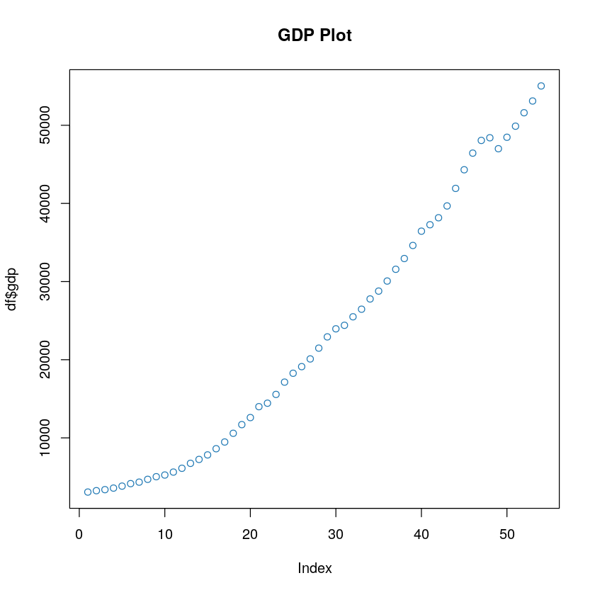
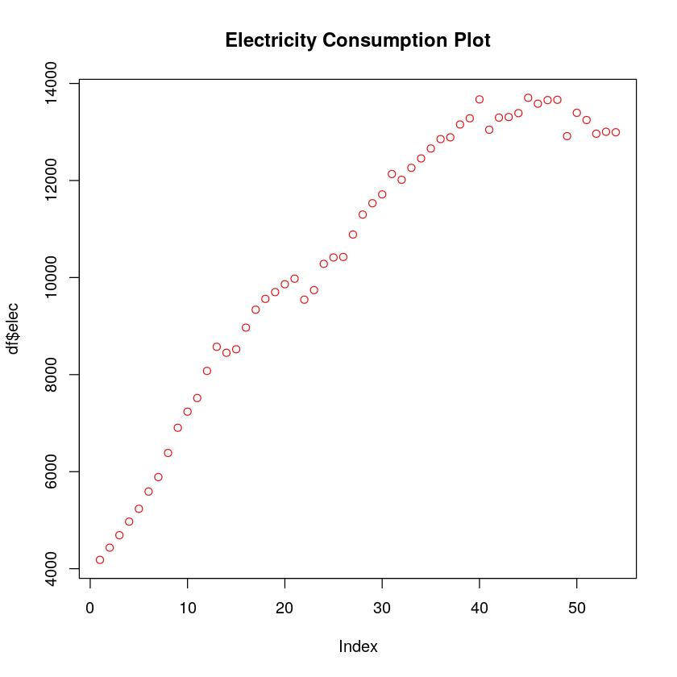
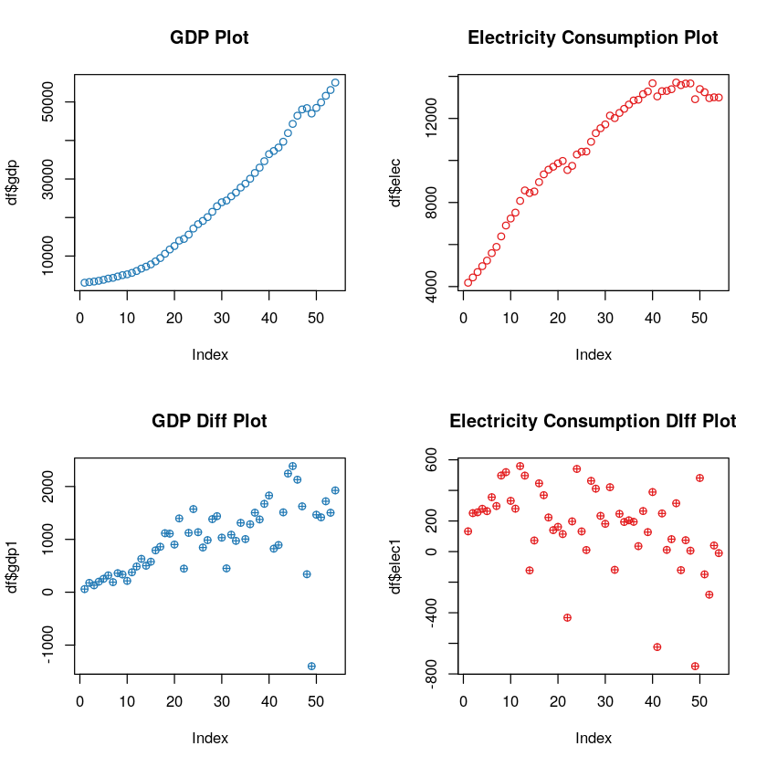

Table of Contents {#table-of-contents .TOC-Heading}
=================

[List of Tables: 2](#list-of-tables)

[List of Figures: 2](#list-of-figures)

[1. Introduction and Literature Review
3](#introduction-and-literature-review)

[1.1. Introduction 3](#introduction)

[1.2 Literature Review 4](#literature-review)

[2. Data 5](#data)

[2.1. Retrieving Data 5](#retrieving-data)

[2.2. Filtering Data 5](#filtering-data)

[2.3. Merging data 6](#merging-data)

[2.4. Transposing Data 6](#transposing-data)

[2.5. Renaming and Cleaning Data 6](#renaming-and-cleaning-data)

[3. Methodology 7](#methodology)

[3.1. Checking Stationarity 7](#checking-stationarity)

[3.1.1. Stationarity Check: Visual Method
7](#stationarity-check-visual-method)

[3.1.1. Stationarity Check: ADF Method
9](#stationarity-check-adf-method)

[3.1.1.A. GDP Stationarity Check: ADF Method
9](#a.-gdp-stationarity-check-adf-method)

[3.1.1.B. Electric Power Consumption Stationarity Check: ADF Method
9](#b.-electric-power-consumption-stationarity-check-adf-method)

[3.2. Making series stationary: 10](#making-series-stationary)

[3.2.1. Applying transformation (First Lag differencing)
10](#applying-transformation-first-lag-differencing)

[3.2.2. Checking for stationarity 11](#checking-for-stationarity)

[3.3. Creating VAR Models 13](#creating-var-models)

[3.4. Selecting VAR Models (Information Criteria)
13](#selecting-var-models-information-criteria)

[3.5. Running model with lag length from selection.
13](#running-model-with-lag-length-from-selection.)

[4. Results & Analysis 14](#results-analysis)

[4.1. Running model summary 14](#running-model-summary)

[4.2. Running Granger Causality test.
15](#running-granger-causality-test.)

[4.2.1. Electric Power Consumption affects GDP.
15](#electric-power-consumption-affects-gdp.)

[4.2.1. GDP affects Electric Power Consumption.
15](#gdp-affects-electric-power-consumption.)

[5. Conclusion 16](#conclusion-1)

[6. Implication & Recommendation 16](#implication-recommendation)

[References: 17](#references)

List of Tables:
===============

[Table 1: Raw GDP data of U.S. sourced from World Bank website
5](#_Toc8803524)

[Table 2: Raw Electrical power consumption data sourced from World Bank
website. 5](#_Toc8803525)

[Table 3: GDP of U.S. 5](#_Toc8803526)

[Table 4: Electrical Power Consumption of U.S. 5](#_Toc8803527)

[Table 5: GDP and Electrical Power Consumption merged. 6](#_Toc8803528)

[Table 6: Transposed dataframe. 6](#_Toc8803529)

[Table 7: Renaming columns and rows of dataframe. 6](#_Toc8803530)

List of Figures:
================

[Figure 1: Original GDP plot. 7](#_Toc8803531)

[Figure 2: Original Electrical Power Consumption Plot. 8](#_Toc8803532)

[Figure 3: Raw and Transformed GDP and Electricity Consumption Plot.
11](#X54852d7e6a43263600867719b06c54b16ff5d29)

1. Introduction and Literature Review
=====================================

1.1. Introduction
-----------------

Every country faces a dilemma in decision making process, for an example
how can the life of people can be improved. Various economist suggest
that we need to first know how to measure people's quality of life. The
one common and easily used measurement is GDP.

GDP signify progress of nation hence; every country would like to
increase their GDP. Any nation with higher GDP will need more resources
for consumption and more energy in converting those resources for
consumption. Consumption of energy can take place either by renewable or
nonrenewable sources.

And energy from both this resource is mostly converted to electrical
energy. So, a country's total energy consumption can be measured simply
by measuring its electrical consumption. Except that this measurement
will not include energy from petrol, diesel, and coal used directly in
engines.

But nevertheless, there is no evidence against the common sense that
electricity increases standard of leaving and productivity of people
(Yao, Luo, & Rooker, 2012 ).

Hence, we try to find relationship between electrical consumption and
GDP of country.

Our goal here is to find whether GDP increases electrical power
consumption or electrical power consumption causes increase in GDP. This
project tries to solve this chicken and egg problem which parameter of
country causes another affect. This will decide whether electrical
consumption is input for higher GDP or it is merely an outcome of higher
GDP.

This study can guide policy makers to make rational decision, rather
than taking populist decision. What this research tries to achieve is to
create a mathematical method to arrive at policy making process.

The reason our research can work is, because there is no guarantee for
existence of symmetry in cause and effect of process.

Since data of country US is well documented since 1960, we choose US for
our study. The data ranges from year 1960 to 2014.

1.2 Literature Review
---------------------

This chicken and egg problem have been analyzed before by various
researchers. A study (Alege, Adediran, & Ogundipe, 2016 )investigated
between GDP per capita and electricity showed that that electricity
causes more proportionate changes in GDP compared to C02. A similar
study (Albiman, Suleiman, & Baka, 2015 ), conducted on Tanzania showed
that both electricity consumption and economic growth rate LGDP causes
C02 emission and that it was also found that electricity and CO2
emission causes a significant positive growth rate in the GDP,
suggesting the government to increase electricity resource to increase
the GDP of country. Similarly, a study Colombia, Ecuador and Mexico
showed a unidirectional relationship between electricity and GDP.
Another study (Majanga, 2015 ) on Malawi Power Sector discussed that
availability of production resources like electricity increases the GDP
growth and suggested for liberalization of resources to eliminate
persistent power shortages. But few of the study (Matar & Bekhet, 2015 )
contradicted that it was the other way round where the increase in GDP
causes increase in electricity consumption of countries like in the case
of Jordan. And in one on case (Križanic & Oplotnik, 2013 ) suggested the
that prices of electricity increases if GDP increases. On of this study
suggested that China energy consumption per GDP was far greater than
that of US and suggested for rest curing of the China's energy
consumption. In similar way in future we can expand our study to various
other factors of nations to find relationship between electricity, GDP
and other parameters of country. A similar study (Sultan, 2012 )done on
Turkey, suggest that conserving electricity as a climate policy may not
be conducive for exports and economic growth. he uses of renewable
sources for electricity may be the right option.

Another study (Mabaso & Karodia, 2014 ) done in South Africa failed to
reach any causality relationship. Another study (Ouedraogo, 2013 )
bifurcated the causality relationship to short and long run electricity
usage and where it was discovered that, the causality is running from
GDP to energy consumption in the short-run, and from energy consumption
to GDP in the long-run.

Based on above literatures, we can say that we have two conditions to
check for:

**1.2.1.** Does electric power consumption affect GDP?

`    ``H0: Electricity does not Granger causes GDP growth.`\
`    H1: Electricity Granger causes GDP growth.`\
`    `

**1.2.2.** Does GDP affect electric power consumption?

`    ``H0: GDP does not Granger causes electrical power consumption.`\
`    H1: GDP Granger causes GDP electricity.`\
`    `

2. Data
=======

2.1. Retrieving Data
--------------------

We retrieve two files (GDP and Electric Power Consumption) from world
bank website and store them into two data frames. The data is shown as
below:

[]{#_Toc8803524 .anchor}Table 1: Raw GDP data of U.S. sourced from World
Bank website

  **Country.Name**   **Country.Code**   **Indicator.Name**              **Indicator.Code**   **X1960**   **X1961**   **⋯**   **X2017**   **X2018**
  ------------------ ------------------ ------------------------------- -------------------- ----------- ----------- ------- ----------- -----------
  Aruba              ABW                GDP per capita (current US\$)   NY.GDP.PCAP.CD       NA          NA          ⋯       25655.102   NA
  Afghanistan        AFG                GDP per capita (current US\$)   NY.GDP.PCAP.CD       59.77733    59.87815    ⋯       550.0685    NA

[]{#_Toc8803525 .anchor}Table 2: Raw Electrical power consumption data
sourced from World Bank website.

  **Country.Name**   **Country. Code**   **Indicator.Name**                            **Indicator.Code**   **X1960**   **X1964**   **⋯**   **X2017**   **X2018**
  ------------------ ------------------- --------------------------------------------- -------------------- ----------- ----------- ------- ----------- -----------
  Aruba              ABW                 Electric power consumption (kWh per capita)   EG.USE.ELEC.KH.PC    NA          NA          ⋯       NA          NA
  Afghanistan        AFG                 Electric power consumption (kWh per capita)   EG.USE.ELEC.KH.PC    NA          NA          ⋯       NA          NA

2.2. Filtering Data
-------------------

From above we can see that files contain data of all countries, while we
need data only for US. So, we filter both of our data frame to obtain
following:

[]{#_Toc8803526 .anchor}Table 3: GDP of U.S.

            **X1960**   **X1961**   **⋯**   **X2017**   **X2018**
  --------- ----------- ----------- ------- ----------- -----------
  **250**   3007.123    3066.563    ⋯       59927.93    NA

[]{#_Toc8803527 .anchor}Table 4: Electrical Power Consumption of U.S.

            X1960      X1961      ⋯   X2017   X2018
  --------- ---------- ---------- --- ------- -------
  **250**   4049.787   4182.176   ⋯   NA      NA

2.3. Merging data
-----------------

Both data (GDP, and Electric Power Consumption) are to be analyzed
together, so it makes sense to merge above data frames, by which we
obtain following:

[]{#_Toc8803528 .anchor}Table 5: GDP and Electrical Power Consumption
merged.

             **X1960**   **X1961**   **⋯**   **X2017**   **X2018**
  ---------- ----------- ----------- ------- ----------- -----------
  **250**    3007.123    3066.563    ⋯       59927.93    NA
  **2501**   4049.787    4182.176    ⋯       NA          NA

2.4. Transposing Data
---------------------

As we see know that timeseries data must have column represented by
parameters rather than time, hence we transpose to data frame to obtain
following:

[]{#_Toc8803529 .anchor}Table 6: Transposed dataframe.

              **250**    **2501**
  ----------- ---------- ----------
  **X1960**   3007.123   4049.787
  **X1961**   3066.563   4182.176
  **X1962**   3243.843   4433.606
  **X1963**   3374.515   4690.486
  **X1964**   3573.941   4970.446
  **1965**    3827.527   5234.685

2.5. Renaming and Cleaning Data
-------------------------------

We rename columns 250 to gdp and 2501 to elec for easier referencing,
also we rename each year by removing X from its first name.

[]{#_Toc8803530 .anchor}Table 7: Renaming columns and rows of dataframe.

             **gdp**    **elec**
  ---------- ---------- ----------
  **1960**   3007.123   4049.787
  **1961**   3066.563   4182.176
  **1962**   3243.843   4433.606
  **1963**   3374.515   4690.486
  **1964**   3573.941   4970.446
  **1965**   3827.527   5234.68

***Note: Everywhere in this document Electrical Power Consumption as
elec and GDP as gdp.***

3. Methodology
==============

3.1. Checking Stationarity
--------------------------

Before continuing our research, we first check whether both of our
series is stationary, or do we need to transform them to make them
stationary. A good quick way is to plot series and see if they are not
making any pattern. Stationary series will never show a pattern.

### 3.1.1. Stationarity Check: Visual Method

On plotting GDP, we obtain following graph:

[]{#_Toc8803531 .anchor}Figure 1: Original GDP plot.

{width="5.036111111111111in"
height="5.226388888888889in"}

From above we see that GDP is showing an upward trend. Let us perform
same test for electrical power consumption as for VAR modeling is
expected that both time series data should be stationary.

On plotting Electrical Power Consumption, we obtain following graph:

[]{#_Toc8803532 .anchor}Figure 2: Original Electrical Power Consumption
Plot.

{width="4.786111111111111in"
height="4.856944444444444in"}

It seems that elec also shows upward trend. We could conclude here that
both of this series are not stationary but a mathematical proof is
always better to make such strong conclusion. Hence in next section we
will perform another test for stationary.

### 3.1.1. Stationarity Check: ADF Method

Since we were unable to make clear conclusion from visual method, it
seems that both of this series are not stationary. So, we perform ADF
test.

ADF (Augmented Dickey--Fuller) test is used to find the unit root in
time series. And presence of unit root nullifies the presence of
stationarity in series.

Thus, for ADF test our:

-   H0: Unit root present: Series is not stationary

-   H1: Unit root not present: Series is stationary

Hence, we expect that our t-value to be lower (in left) of critical
value so that we can reject our null hypothesis that series is not
stationary and continue for VAR modeling

### 3.1.1.A. GDP Stationarity Check: ADF Method

Performing ADF test on GDP we obtain:

Output:

Critical Value: -2.89\
`T Value: 2.1618  `

On performing ADF test on GDP, we see that t value (2.16) is to right of
the critical value (-2.89), hence we cannot reject null hypothesis, thus
this series is not stationary and we cannot proceed for VAR modeling as
we will have to make stationary.

### 3.1.1.B. Electric Power Consumption Stationarity Check: ADF Method

Similarly, on performing ADF test on Electric Power Consumption we
obtain:

Output:

Critical Value -2.89

`T Value: -4.3814  `

On performing ADF test on Electric Power consumption, we see that t
value(-4.38) is to left of the critical value(-2.89), hence we can
reject null hypothesis, thus this series is stationary and we can
proceed for VAR modeling as we will not have to make stationary.

But comparing difference as one parameter and actual values at one
parameter will be a wrong comparison, hence all transformation to be
applied on GDP will be applied to Electric power consumption from here
ontt.

3.2. Making series stationary:
------------------------------

### 3.2.1. Applying transformation (First Lag differencing)

Although it is argued to take log of difference but taking log of
difference is a two-step procedure and we will lose important
information of our model on doing so.

Moreover, when we took log differencing, we did not obtained
stationarity in GDP.

So, we will continue with simple differencing. The interpretation of
such transformation is that does changes in GDP affects changes in
Electric Power consumption. We perform same test again on the
transformed series

The transformed series can be explained following equation:

For GDP:

$\text{gdp}1 = \text{gd}p_{t} - \text{gd}p_{t - 1}$

For Electrical Power Consumption:

$\text{elec}1 = \text{ele}c_{t} - \text{ele}c_{t - 1}$

### 3.2.2. Checking for stationarity

#### 3.2.2.1. Stationarity Check: Visual Method (First Lag Differences)

In order to proof that our transformation was successful, we will plot
them along with original parameters plot.

[]{#X54852d7e6a43263600867719b06c54b16ff5d29 .anchor}Figure 3: Raw and
Transformed GDP and Electricity Consumption Plot.

{width="5.348611111111111in"
height="6.022916666666666in"}

As we can see from above plots that GDP is not showing any clear trend
and same can be said from electricity power consumption. But here again
we will perform mathematical test to reinforce our conclusion.

#### 3.2.2.A. GDP Stationarity Check: ADF Method

Output:

Critical Value: -2.89

`T value: -3.3569 `

On performing ADF test on GDP, we see that t value (-3.35) is to left of
critical value (-2.89), hence we can reject null hypothesis, thus this
series is now made stationary and we can proceed for VAR modeling.

#### 3.2.2.B. Electric Power Consumption Stationarity Check: ADF Method

Output:

Critical Value: -2.89

`T Value: -4.3814 `

On performing ADF test on Electrical Power Consumption, we see that t
value (-4.38) is to leave of the critical value (-2.89), hence we can
reject null hypothesis, thus this series is now made stationary and we
can proceed for VAR modeling.

3.3. Creating VAR Models
------------------------

There can be different optimum model based on different model's
information criterion for selection. Following are those information
criteria(s):

1.  Akaike information criterion (AIC)

2.  Bayesian information criterion (BIC) or Schwarz criterion (SC)

3.  Final Prediction Error (FPE) criterion

4.  Hannan--Quinn information criterion (HQC)

3.4. Selecting VAR Models (Information Criteria)
------------------------------------------------

The choice of selecting a particular information criterion is out of
scope of our study, we simply choose Schwarz criterion (SC) criterion
most commonly known as BIC.

SC(n): 1

Based on selecting SC we obtain a model of type lag 1 which can be used
to study Granger Causality.

3.5. Running model with lag length from selection.
--------------------------------------------------

While this step does not produce any output but is an important,
nevertheless. In this step we pass lag=1 as parameter to VAR modeling.
This model is saved for further result.

While our major part of our methodology ends here, now the next part
involves result and analysis.

4. Results & Analysis
=====================

As mentioned earlier, that we have saved our model, hence we retrieve
model summary to obtain following results.

4.1. Running model summary
--------------------------

We can make following conclusion after running model

**4.1.A.** For GDP equation:

$\text{gdp} = \text{gdp}_{1} + \text{elec}_{1} + \text{const}$

1.  $\text{gd}p_{1}$ is significant.

2.  $\text{ele}c_{1}$ is insignificant and can be ignored.

3.  $\text{const}$ is significant

Hence, GDP is dependent only on lag of itself and not on lag of
electricity power consumption.

**4.1.B.** For Electrical power consumption equation:

$\text{elec} = \text{gdp}_{1} + \text{elec}_{1} + \text{const}$

1.  $\text{gd}p_{1}$ is significant.

2.  $\text{ele}c_{1}$ is insignificant and can be ignored.

3.  $\text{const}$ is significant.

Hence, Electrical Power consumption is dependent only on lag of GDP but
not on its previous values.

The above analysis can be done in better way by using Granger Causality
test. Hence in next portion we will perform Granger Causality test.

4.2. Running Granger Causality test.
------------------------------------

### 4.2.1. Electric Power Consumption affects GDP.

Does electric power consumption affect GDP? We run the test with
following assumption derived from section **1.2.1**. Literature Review:

`    ``H0: Electricity does not Granger causes GDP growth.`\
`    H1: Electricity Granger causes GDP growth.`\
`    `

`Output:`

`p-value = 0.03126`

Since, p-value is more than 0.05 we cannot reject the null hypothesis
that electric power consumption does not affects the GDP, hence,
electric power consumption does not affects the GDP, moreover it can be
seen from **4.1.A.**, where coefficient of $\text{ele}c_{1}$ is
insignificant

### 4.2.1. GDP affects Electric Power Consumption.

Does GDP affect electric power consumption? We run the test with
following assumption derived from section **1.2.2.** Literature Review:

`    ``H0: Electricity does not Granger causes GDP growth.`\
`    H1: Electricity Granger causes GDP growth.`\
`    `

`Output:`

`p-value = 0.00673`

Since, p-value is less than 0.05 we can reject the null hypothesis that
GDP does not affects the electric power consumption, hence, GDP affects
the electric power consumption moreover the same can be concluded from
**4.****1.B.**

5. Conclusion {#conclusion-1}
=============

As we see that from **4.1.** while running model summary, that adjusted
R square of our model is around .99 for both cases. Hence, we are in a
good position to make very strong conclusion, though this large adjusted
R square can be due to autocorrelation present in the model.

While **4.1.A. & 4.1.B.** was sufficient enough to derive our
conclusion, but we still carried out Granger Causality test which gave
same results.

In short, we conclude that:

Electrical Power Consumption GDP

GDP Electrical Power Consumption

As far as result are concerned it will be right to conclude that
increase in electric power consumption will not increase GDP but the
vice versa, i.e. increase in GDP will lead to increase in electric power
consumption is true.

6. Implication & Recommendation
===============================

The possible reason could be that in case U.S., electricity consumption
is not the main driver of GDP, while increase in GDP will create more
demand for electricity consumption.

So, it is suggested that in order to increase the GDP. U.S. should not
concentrate on amount of electricity consumption, but on various other
factors. And on doing so if GDP increases, it will force the nation to
consume more electricity.

An alternative way is thus not to give discounts on electricity but to
make electricity available to more people and use the funds for other
factor explaining standard of leaving.

It is thus recommended policy makers to not prioritize the electrical
power consumption in order to increase GDP.

References:
===========

Albiman, M. M., Suleiman, N. N., & Baka, H. O. ( 2015 ). The
Relationship between Energy Consumption, CO2 Emissions and Economic
Growth in Tanzania . *International Journal of Energy Sector Management
, 9* , 361-375. doi: 10.1108/IJESM-05-2014-0006 Alege, P. O., Adediran,
O. S., & Ogundipe, A. A. ( 2016 ). Pollutant Emissions, Energy
Consumption and Economic Growth in Nigeria: A Multivariate Granger
Causality Framework . *International Journal of Energy Economics and
Policy , 6* , 202-207. Križanic, F., & Oplotnik, Z. J. ( 2013 ). Market
Changes, Business Cycles and Fluctuations in Electricity Prices-EU
Evidence from Germany and Slovenia . *International Journal of Energy
Economics and Policy , 3* , 118-126. Mabaso, S., & Karodia, A. M. ( 2014
). An Evaluation of Factors Leading to Disequilibrium of Electricity
Demand and Supply in Gauteng Province . *Nigerian Chapter of Arabian
Journal of Business and Management Review , 2* , - . Majanga, B. B. (
2015 ). Liberalization of Utility Services in the Developing Countries:
A Panacea to Economic Development? an Analysis on Malawi Power Sector .
*Applied Economics and Finance , 2* , 110-118. Matar, A., & Bekhet, H.
A. ( 2015 ). Causal Interaction among Electricity Consumption, Financial
Development, Exports and Economic Growth in Jordan: Dynamic Simultaneous
Equation Models . *International Journal of Energy Economics and Policy
, 5* , 955-967. Ouedraogo, N. S. ( 2013 ). Energy Consumption and
Economic Growth: Evidence from the Economic Community of West African
States (ECOWAS) . *Energy Economics , 36* , 637-647. doi:
10.1016/j.eneco.2012.11.011 Sultan, R. ( 2012 ). An Econometric Study of
Economic Growth, Energy and Exports in Mauritius: Implications for Trade
and Climate Policy . *International Journal of Energy Economics and
Policy , 2* , 225-237. Yao, S., Luo, D., & Rooker, T. ( 2012 ). Energy
Efficiency and Economic Development in China . *Asian Economic Papers ,
11* , 99-117. doi: 10.1162/ASEP\_a\_00147
