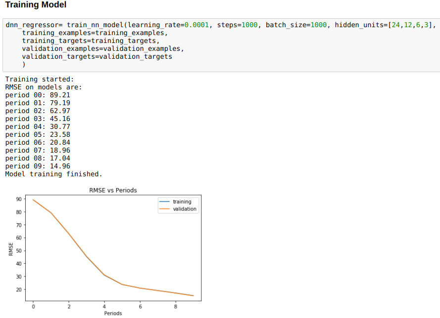

An Investigation into The Efficacy of High Frequency Trading Prediction.

**Abstract:**
-------------

Previous studies to predict stock markets never took fundamental
financial ratios into account, even if they did it was limited to 3-5 of
them. The previous studies have large frequency typically of month or
quarter making them ineffective for daily trading. This paper attempts
to solve few of those problems and predict stock returns.

The model in this paper uses machine learning to predict the nonlinear
behavioural pattern of National Stock Exchange of India. As mathematical
models are limited the amount of equations one can derive with
econometrics.

Total of 565 active companies listed in NSE were taken into modelling
purpose for this study.

This model could easily be extended to high frequency trading by
decreasing the frequency further down.

Table of Contents {#table-of-contents .TOC-Heading}
=================

[**Abstract:** 1](#abstract)

[1. THEORY AND HYPOTHESES 3](#theory-and-hypotheses)

[BACKGROUND STUDY 4](#background-study)

[2. PROPOSED METHOD 9](#proposed-method)

[2.1 Justification 10](#justification)

[2.2 Data selection 11](#data-selection)

[2.3 Data collection 14](#data-collection)

[2.4 Grouping stocks into sectors. 15](#grouping-stocks-into-sectors.)

[2.5 Panelising Datasets 17](#panelising-datasets)

[2.6 Merging Dataset 18](#merging-dataset)

[2.7 Cleaning Data 18](#cleaning-data)

[2.8 Creating Model 18](#creating-model)

[2.9 Denormalization Values 18](#denormalization-values)

[2.10 Obtaining Actual Values and Error Values
18](#obtaining-actual-values-and-error-values)

[3. RESULT 19](#result)

[4. DISCUSSION 23](#discussion)

[Conclusion: 24](#conclusion)

[Limitation and Recommendations for Future Research:
25](#limitation-and-recommendations-for-future-research)

[REFRENCES 26](#refrences)

[APPENDIX 28](#appendix)

[**Appendix A: Abbreviations** 28](#appendix-a-abbreviations)

[**Appendix B: Links** 29](#appendix-b-links)

[**Appendix C: Sectors Data** 30](#appendix-c-sectors-data)

[**Appendix D: Filtered Financial Ratios**
32](#appendix-d-filtered-financial-ratios)

An Investigation into The Efficacy of High Frequency Trading Prediction.

Many studies have already proved that stock market is inefficient. Thus,
many others have attempted to predict the stock market. But none of the
previous studies took all the financial fundamentals into account
knowing so well that finical fundamentals are reason of stock price,
mainly due the large frequency of release of finical statements by
companies often as long as one quarter to one year. The previous studies
used time-based prediction hoping to find the trend and seasonality of
the stock prices.

This study attempts to solve all those problems, there by introducing
the newer method of predicting the stock market returns with frequency
as low as one day. By using the machine learning to predict the stock
market we also include in out model any nonlinear behaviour of stock
market.

But this study is devoid of any time-based parameters which might affect
the outcome of modelling.

The NN model have been quite successful in predicting various non-linear
patterns, thus we use NN model for predicting stock market.

We believe that there exists a relationship between financial
fundamentals of the company and a no linear pattern of stock market,
thus we try to find weather or no they exist by making a model and then
trying to predict future stock.

Our model is an attempt to predict the returns and crises which could
occur in stock market and thus signal the policy maker before the
crises, as effect of very policy is lagged by some amount. Predicting
this behaviour from before could possibly avert the situations.

THEORY AND HYPOTHESES
=====================

High Frequency Trading is an automated trading platform built by
powerful computers used by institution to transact in stock markets. The
institution can be Investment Banker, Hedge Funds (Durbin, 2010).

Data analytics and Machine Learning have enabled the HFT to become
automated.

Various institution is now using HFT to can gain favourable returns on
investment.

The evolution of technology has now empowered even common man to
analysis and predict various phenomenon. This project by taking
advantage of technology attempts to predict the upward or downward
movement of Indian Stock market.

But before we attempt to develop our model we wanted to analyse the
previous work done by various scholars and researchers, so that we do
not have to re-invent the wheel and at same time if possible improve on
their work.

BACKGROUND STUDY
----------------

The prediction of stock market can be classified into two types:

A.  Fundamental Analysis: based on macroeconomic data and the basic
    financial status of companies like money supply, interest rates,
    divided yields, cash flow, book to market ratios and other financial
    ratios or lagged returns (Fama & French, 1988); (Ikenberry,
    Lakonishok, & Vermaelen, 1995).

B.  Technical Analysis: based on assumption that that history will
    repeat itself in some defined pattern and there exist correlation
    between price and volume of stock traded for ex. Two such studies
    (Smirlock & Starks, 1985); (J., 1986) depicted the patterns and
    trends in price and volume charts.

Background Studies:

In 2012 a research paper (MacKenzie, Beunza, Millo, & Pardo-Guerra,
2012) contradicted that High Frequency Trading due to its complex nature
was available to select few with high resource thus making market opaque
to outsiders. It also argued that, as to how some hedge funds were able
to avail public-limit order book from SEC thus causing the information
imbalance as those people with access to public-limit order books were
easily able to use it in their HFT platform howsoever the profits were
small.

The public order books are beyond our reach and NSE provides them to
only financial institute, hence we research will not include them. But,
it also proves that HFT can help us make better investments.

A statistical analysis (Pant & Bishnoi, 2001) conducted on Indian Stock
Market Indices to check for random walk hypothesis rejected the null
hypothesis of random walk. Which meant that Indian Stock Market are not
fully efficient that they do not follow any pattern, instead exited a
clear pattern of stock prices changed in market.

This model conducted Q-statistics & Dickey-Fuller test on the datasets
available from BSE. The study also concluded that there existed a clear
pattern between daily and weekly return. It also encourages us to create
a predictive model of the same.

In another study (Brogaard, Hendershott, & Riordan, 2014) which examined
the role of HFTs in price discovery process it discussed about how the
HFTs are replacing the intermediary in stock market i.e. replacing the
brokers with automation.

The study took the transactional level data from NASDAQ to identify the
buying and selling of large group of HFTs. This study also discussed as
to how short lived are quality of HFT prediction generally 3-4 seconds.
Also, some time the information if reached to consumer late can also
lead to negative returns on investments.

Taking this study into accounts we have taken our data period to be of
day rather than seconds. Also, infrastructure as of now does not allow
for per second analysis.

In another financial research paper (Beaver, 1968) it was found that
prices of stock can be used to determine the failure of the firm. This
was done using a unique equation of finding the changes in stock prices
and adding them with the divided on the security to deduce a factor
which was then further used to predict firm's failure.

The cross-sectional and time-series analysis of this research were
consistent with proving that a. Investors recognize and adjust to price,
b. change in prices causes the investor to use financial ratios for
determine choice.

Hence this study enhances the theory of model that financial ratios can
be good determinant

for predicting the stock prices.

In 2010 a research (Zhang, 2010) proved that there exists correlation
between release of financial statement of the company and most often for
short period of time, the market over-reacts while in long term the
effect subsides.

Hence, we will take a variable time "t", value of which will be reset
quarterly, as most of the company release their financial information
quarterly.

Statistical Methods:

In another study (Pai & Lin, 2005) a comparison among ARIMA and SVM was
done, where the ARIMA method failed to identify the non-linearity of
stock and thus SVM was suggested to be better model for predicting the
stock market. So, the author used both ARIMA and SVM, taking advantage
of ARIMA for predicting past and SVM for predicting future.

Since this study was done on S&P 500, hence we will try to implement SVM
with other NN techniques on NSE.

In 2000 a model (Engle, 2000), developed using semi parametric approach
by introducing a time variable, which resulted in a discovery of
relation between short term and long-term price volatility. The
modelling was done by passing intensities of ACD model to GARCH model.
Where both returns, and risk were found to be negatively influenced by
long durations.

Hence, we must also add a long-term time variable having longer reset
time of around 1 year.

Neural Methods:

A Review research paper (Vui, Soon, On, & Alfred, 2013) mentioned how
artificial neural network can be used to predict the market prices and
average movement. The article disused how we can use the example of
artificial neuron to develop mathematical model to develop ANN
architecture. In this method the weights of variables were determined
using many layers of inputs by calculated brute-forcing to determine the
outputs.

In another comparative research (Vaisla & Bhatt, 2010) the authors
predicted the stock market prices using first the statically model and
then the NN method. They then calculated MAPE, MSE, RMSE of the errors
generated in both the cases. The conclusion of the result was that NN
model perform much better than their statistical counterpart.

Hence, we may better off by skipping statistical model and simply aim
for NN method. But our model permits us use NN and statically operations
on the same time, hence we choose statically model first.

Another literature review (R.K. & Pawar, 2010) suggested that the linear
model of predicting stock was inferior with respect to Artificial neural
network. The review suggested that NN was better at predicting the stock
index, also it was able to describe better whether to buy or hold the
stock.

Hence, if the time permits, we can grow the model to accommodate Machine
Learning.

In another study (Boyacioglu & Avci, 2010) for predicting the returns on
the stock prices of Istanbul Stock Exchange (ISE), ANIFS was used with
six macroeconomic variables and three indices. The study concluded
marking ANIFS an inexpensive or softer computing tool for enhancing the
model.

Since, here the ANIFS were limited to only few financial fundamental
data, our model will produce quite different result than this model if
ANIFS were carried out.

A comparative study (Kara, Boyacioglu, & Baykan, 2011) done to predict
the stock market of Istanbul between the technique ANN and SVM showed
that ANN model was able to predict the prices with better accuracy than
the SVM model. Here the ANN model had performance of 75.74% while the
SVM has score of 71.52%.

Since score of ANN and SVM are close to each other our model will not
biased among the choosing between ANN or SVM.

In conference proceeding (Kimoto, Asakawa, Yoda, & Takeoka, 1990) it was
demonstrated that TOPIX stock market can be accurately predicted and
simulated by using modular neural methods. In this method several
modular neural methods were used to predict the market in tandem.

Thus, we will have to take great care to keep our system as modular as
possible.

Another study (K & T, 1990)developed a pattern recognition technique to
predict the prices of TOPIX where recurrent networks were used to
decrease the mismatching patterns.

The study of which may be redundant in NN method.

Econometric Methods:

In another research paper (Maku & Atanda, 2012) it was found that in
Nigeria Stock Exchange major determinants of the stock market were
exchange rate, inflation, money supply, and economic growth rather than
treasury bills in long run. This test was done using ADF and unit root
test.

Since our project is to find short term movement of stock, we must
remove any macroeconomic variables form our equation. But still they can
be used as constants in equations.

**In another study** (Olweny & Kimani, 2011) **by the use of Granger
Causality test established the link between stock market performance and
the economic growth of the country. This test was based on VAR model
with ADF unit test to prove the same.**

**Since, this along with other papers point out that macroeconomic
variables can influence the market and we now are convincing to add them
in our model make it more accurate.**

**In another research paper** (A.M. & Teneboah, 2008)**quarterly data of
macroeconomics like FDI, treasury bills, CPI, crude oil price, exchange
rate were used to predict the stock market of Ghana. Where VECM method
was used to predict the stock market. The research proved that there
exists correlation between lagged values of interest rates and
inflation.**

Social Methods:

In a semantic analysis (Asur & Huberman, 2010) done using social media
(twitter.com) to predict the sales office of movies provided another
extension of predicting the stock market using social media. This paper
proved that sentiments extracted from Twitter was outperforming
market-based predictors. This model was made by finding out the rates at
which tweets occurred using the API provided by Twitter.

Our study will no perform any semantic analysis, but we will keep in
mind our model's structure to accommodate them in future.

A psychological research (Alter & Oppenheimer, 2006) concluded that the
fluency of name of stock, familiarity with name of company were
positively correlated to performance of that stock. The research
identified how cognitive approaches can outperform traditional numerical
predictions.

Classifying all the names of companies listed in NSE is impossible
without a survey with around 2000 questions (number of companies listed
in NSE), hence we will not include them in our model.

In a social research (Rao, Davis, & Ward, 2000) the author studied why
firms defected from NASDAQ to NYSE and how social identity can affect
the probability of defection, and movement of price of stocks.

Hence to remove this bias we limit our research to NSE at same time
remove all the firms inactive for 1 year.

PROPOSED METHOD 
===============

The method of statics limits the model to only linear trends. Also, it
is limited by the amount of formula one can learn on statistics. It is
due to this reason that we changed our earlier method to the machine
learning specifically Neural Networks.

Neural networks have capability of predicting even the non-linear
relationship among the dependent and independent variables.

Also, various articles as discussed above have derived better results
than conventional ARIMA models.

We start by creating a penal of following variables:

1.  Daily return derived from stock closing price.

2.  Filtered Financial Ratios as given in Appendix D.

**Re-Indexing:**

We re-index our panel as the NSE is closed on Saturday, Sunday and
Holidays, thus now row exist for this date. We add null values for the
entire columns.

**Interpolating:**

The empty rows created by above step is now filled using interpolating
by the method of "spline" interpolation which is used in shipbuilding
for creating elastic rulers.

**Normalizing the data:**

ML networks unlike there statically are affected by the magnitude of the
independent variables. Thus, we normalized the data using flowing
formula which scaled out data from 0 to 100, also our activator function
will not work on negative value hence we normalize the data to positive
scale:

$\text{normalized}x = \frac{100 \ast X - \min\left( x \right)}{\max\left( x \right) - \min\left( x \right)}$

**Shuffling Data:**

All the data are now shuffled so that our model will not biased on
training and validation set.

**Splicing Dataset:**

We divide our dataset in 80:20 ratio where our model train on 80% of
data (training set) and predicts on 20% of data (validation set) which
gives us the RMSE values between training and Prediction set.

**Training model:**

Our model is trained using TensorFlow API developed by google for
machine learning. We use DNN regressor with Adagard optimizer.

We also use RELU activation function in hidden layers of DNN regressor
to introduce non-linearity in our model.

The matrix of independent variables is cross-multiplied by DNN regressor
to construct a weight matrix on each node of the NN.

The model is iterated to target for obtaining lower loss function and by
gradient descent.

**Testing model:**

During training we frequently post the RMSE value of prediction of
training and validation set to determine if the model is learning or
not.

Reusing Trained model:

Now we reuse the trained model to predict for stock prices from
2018-04-12 to 2018-04-18 and calculate the RMSE value of predicted and
actual value.

Justification
-------------

We know that various research (Vui, Soon, On, & Alfred, 2013); (Vaisla &
Bhatt, 2010); (R.K. & Pawar, 2010); (Boyacioglu & Avci, 2010); (Kara,
Boyacioglu, & Baykan, 2011) that NN methods are far better than
statically methods like ETS, ARIMA, thus we went for neural network or
NN method of machine learning rather than traditional econometrical
methods to predict the stock prices.

But none of them consider the comprehensive list of financial ratios as
taken up by us.

Our belief is that the large error in prediction was not the inherent
incapability of the econometrics but the large amount of independent
variable which had high correlation with the stock prices.

The problem lies not in the mathematics but the fundamental concept that
mispricing of the stock can be easily calculated using financial ratio
by using the concept of calculation of intrinsic value of firm.

It is the mispricing of stock which generates gains or loss for
investors.

Most of the studies done before having hugely concentrated on
econometrics but less on the financial report of the company even when
knowing so well that there exists the concept of leveraged beta which is
affected by Debt to Equity ratio of the company.

Our study in no means disregard the previous work but tries to append on
them and make them more accurate by mixing the concept of finance and
econometrics together.

Knowing so well that there are not one but many possible predictor
variables for the stock intrinsic value, hence we take into our model as
many financial ratios we can; the list of which can easily obtained from
Appendix D.

Data selection
--------------

> We selected following dataset for our model:
>
> Part A:
>
> Time series data of every company traded in National Stock Exchange
> (NSE) for over 15 years. This data has a frequency of 1 day and
> contained following columns as shown in Figure 1:

1.  Date of each day since 2008 (Will increase to 2003 if needed). Used
    as index.

2.  Ticker column: Specifying the code of stock (For ex. Tata Steel it
    is TATASTEEL)

3.  Open Price

4.  High Price

5.  Low Price

6.  Last Price

7.  Close Price

8.  Total Quantity Traded: Number of stocks in circulation

9.  Turnover: In lakhs of market capitalization.

{width="6.530555555555556in"
height="2.58125in"}

> Figure1: Sourced from our model Jupyter notebook.
>
> From the above listed columns, we only consider:

1.  Stock returns calculated from closing price.

2.  Total Quantity Traded.

3.  Turnover: In lakhs of market capitalization.

> Part B:

Various financial data of companies annual or quarterly (list of all the
terms are also available in Appendix D) and listed below:

  **Sr. No**   **Indicator Code**   **Name**                                                            **Period**
  ------------ -------------------- ------------------------------------------------------------------- ------------
  1            BSEVOL\_Q            BSE Trade Volume                                                    Quarterly
  2            EQCAP\_Q             Shareholders Equity                                                 Quarterly
  3            EBIDTSH\_Q           EBIDTA Per Share (Unadjusted for splits/rights/bonus)               Quarterly
  4            REVSH\_Q             Revenue Per Share (Unadjusted for splits/rights/bonus)              Quarterly
  5            ETR\_Q               Corporate Tax Rate                                                  Quarterly
  6            MCAP\_Q              Market Capitalization                                               Quarterly
  7            OP1Q\_Q              1 Quarter Growth in Operating Profit                                Quarterly
  8            NI1Q\_Q              1 Quarter Growth in Net Income                                      Quarterly
  9            OPMSH\_Q             Operating Profit Per Share (Unadjusted for splits/rights/bonus)     Quarterly
  10           EBIDT1Q\_Q           1 Quarter Growth in EBIDTA                                          Quarterly
  11           PBT\_Q               Profit Before Tax                                                   Quarterly
  12           PBDT\_Q              Profit Before Depriciation and Tax                                  Quarterly
  13           OPSH1Q\_Q            1 Quarter Growth in Operating Profit per Share                      Quarterly
  14           DIVSH\_Q             Dividend Per Share (Unadjusted for splits/rights/bonus)             Quarterly
  15           NP\_Q                Net Income                                                          Quarterly
  16           DIV\_PCT\_Q          Percent of Dividend Declared (As a percent of Face Value)           Quarterly
  17           EPS1Q\_Q             1 Quarter Growth in EPS                                             Quarterly
  18           OI\_Q                Other Income                                                        Quarterly
  19           INT\_Q               Interest                                                            Quarterly
  20           SR\_Q                Revenue                                                             Quarterly
  21           BSEH\_Q              Unadjusted BSE High Price                                           Quarterly
  22           OEXPNS\_Q            Operating Expenses                                                  Quarterly
  23           SHARE\_Q             Number of Outstanding Shares (Unadjusted for splits/rights/bonus)   Quarterly
  24           BSEC\_Q              Unadjusted BSE Close Price                                          Quarterly
  25           TAX\_Q               Income Tax Expense                                                  Quarterly
  26           BSEO\_Q              Unadjusted BSE Open Price                                           Quarterly
  27           FV\_Q                Face Value                                                          Quarterly
  28           OP\_Q                Operating Profit                                                    Quarterly
  29           DEP\_Q               Depreciation Expense                                                Quarterly
  30           EBIDTSH1Q\_Q         1 Quarter Growth in EBIDTA per Share                                Quarterly
  31           EBIDT\_Q             Earning Before Interest, Depreciation & Taxes (EBIDTA)              Quarterly
  32           EPS\_Q               Earnings per Diluted Share (Unadjusted for splits/rights/bonus)     Quarterly
  33           BSEL\_Q              Unadjusted BSE Low Price                                            Quarterly
  34           TI\_Q                Total Income                                                        Quarterly

For example, Annual Cash Flow Return on Assets of Tata Consultancy is
shown in Figure 2.

{width="4.041666666666667in"
height="3.6041666666666665in"}

Figure 2: Sourced from our model Jupyter notebook.

Data collection
---------------

> The Part A of data came from NSE dataset which was available via
> Quandl website published by NSE and open sourced, Link(quandl.org)
> \[4\]. We selected 525 companies for our research.
>
> The Part B of data was available as a sample from Quandl website
> published by: D'MARKET which have already purchased, (quandl.org)
> \[2\].
>
> The use of python programming helped us aggregate data via API calls.
>
> For example, here are API calls for:
>
> Part A: {width="6.268055555555556in"
> height="0.6361111111111111in"}

Figure 3: Sourced from our model Jupyter notebook.

> Part B:
>
> {width="6.268055555555556in"
> height="0.2881944444444444in"}

Figure 4: Sourced from our model Jupyter notebook.

While collecting data for PART A, we encountered following issues:

1.  The time series dataset of all NSE Tickers for 10 years was so
    larger than 400Mb, which was saturating our Azure Instance ram.

2.  Prices of most of the stocks were affected due to changes in sector
    of the industry, thus a newer problem of isolating the issue of
    sector have arrived.

To solve for above problems, we started grouping stocks based on sectors
as described below in point 3.3.

Grouping stocks into sectors.
-----------------------------

A trader forum had an article listing all the NSE tickers and their
respective sectors, we took those data and structured them.

From the data obtained we applied count function on "sector" column to
obtain the number of industries in the sector we came across following
data, snapshot of which is presented below in Figure 5 and the full list
can be obtained in Appendix A.

> {width="4.604166666666667in"
> height="6.291666666666667in"}

Figure 5: Sourced from our model Jupyter notebook.

Now from above data a program was made to loop through all the company's
data and save them in CSV file sector wise, available at \[8\]. The
structure of which is showing in Figure 6.

{width="6.268055555555556in"
height="3.3340277777777776in"}

Figure 6: Sourced from our model Jupyter notebook.

The CSV file looks like following for AVIATION sector, where dash line
represents all the between the above and below dates, Figure 7.

  **Date**                                                          **Ticker**       **Open**   **High**   **Low**
  ----------------------------------------------------------------- ---------------- ---------- ---------- ---------
  10-03-2008                                                        NSE/JETAIRWAYS   646.25     665        600
  11-03-2008                                                        NSE/JETAIRWAYS   630        648        605
  \-\-\-\-\-\-\-\-\-\-\-\-\-\-\-\-\-\-\-\-\-\-\-\-\-\-\-\-\-\-\--                                          
  08-03-2018                                                        NSE/JETAIRWAYS   708.15     717        655.45
  09-03-2018                                                        NSE/JETAIRWAYS   698        709.75     682
  06-10-2008                                                        NSE/KFA          60.3       60.9       52.6
  07-10-2008                                                        NSE/KFA          53.5       56.5       50.9
  \-\-\-\-\-\-\-\-\-\-\-\-\-\-\-\-\-\-\-\-\-\-\-\-\-\-\-\-\-\-\--                                          
  22-09-2014                                                        NSE/KFA          2.35       2.4        2.2
  23-09-2014                                                        NSE/KFA          2.25       2.25       1.95

Figure 7: Sourced from AVIATION.csv file of project

Panelising Datasets 
-------------------

The data in the csv file is in the form of 2-dimensional array. This
array although good for saving data to file is unusable for calculation
as we have 3 axis instead of 2 axis, following are axis:

1.  Date

2.  Ticker

3.  All the columns like Open, Close, Financial ratios

Now we have to convert this 2d data to 3d data where we can accommodate
3 axis.

Thus now our data looks like Figure 9:

{width="5.270833333333333in"
height="3.151388888888889in"}

Figure 9: Made only for visualization via MS Paint.

Hence now we have slices of particular ticker and also of all of those
tickers sharing same:

A.  Date as Index

B.  Various Columns like Open Price, Ratios etc.

Thus, our data is now panelised and ready for performing further
calculation.

Merging Dataset
---------------

The merging of dataset has been completed and now we faced following
problems:

1.  The frequency of ratios are quarterly while the stock prices are
    daily.

2.  Only few ratios are available for all the companies.

3.  The start and ending date of prices and ratios were not matching as
    they were unavailable for most of the companies (95%).

4.  Many companies were not trading for year or quarter, thus bringing
    more empty spaces in our data.

    1.  Cleaning Data 
        -------------

The above issues mentioned in merging dataset is nothing but the
uncleaned data. So, we now address them in following way:

1.  The ratios were merged using date as indexes. The empty spaces were
    interpolated.

2.  We looped through all the companies listed in NSE with our core
    financial data and removed those ratios which were not available
    even for single companies, reducing our ratios from around 200
    datasets to only 34. Kindly refer to Appendix D.

3.  The merged panel was sliced with start date of ratios.

4.  All those companies which are inactive for a month (30 days) were
    removed from our merged panel.

    1.  Creating Model
        --------------

We use following settings with DNN regressor:

1.  Learning Rate: 0.0001

2.  Batch Size: 5000

3.  Hidden Layer Matrix: 24, 12, 6

After running DNN regressor as mentioned above in Proposed Method
section we obtained the DNN regressor object which is used to predict
returns from 2018-04-12 to 2018-04-18.

Denormalization Values
----------------------

> The data obtained is now denormalized using following equation to
> obtain returns:
>
> $X = \min\left( x \right) + \text{normalized}\frac{x \ast \left( \max\left( x \right) - \min\left( x \right) \right)}{100}$

This was done to bring back the original data before the normalization.
As all the values so obtained till now are in from 1 to 100 rather than
the original values.

Obtaining Actual Values and Error Values
----------------------------------------

Now the actual market returns of the companies in the sector are
obtained and subtracted with the predicted values to get errors, RMSE,
error percentage.

RESULT
======

After performing all the above steps, we obtain following:

A.  RMSE values of Testing and Validation Set:

Occasionally our model will pause in between training phase of training
dataset and will predict some values for validation set. This gave us
some error between training and validation set. This error was converted
to RMSE value. This error was consistent for both training and test data
set as can be seen from the graph.

The RMSE value was calculated using following formula:

$\text{RMSE} = \sqrt{}\left( \frac{\sum{Y\text{predicted}}^{2} - {Y\text{actual}}^{2}}{N} \right)$

{width="6.268055555555556in"
height="4.540972222222222in"}

B.  Predicted values (Full table Included in Excel File):

Now we obtained our trained object of NN regressor which was then used
to predict the stock returns for all the companies from 12-04-2018 to
18-04-2018.

  Date         NSE/ARIES     NSE/BAYERCROP   NSE/CHAMBLFERT   NSE/COROMANDEL
  ------------ ------------- --------------- ---------------- ----------------
  12-04-2018   -0.33431542   -0.31243646     0.38680434       0.19269156
  13-04-2018   -0.33426464   -0.31401527     0.4740417        0.18876958
  14-04-2018   -0.3342142    -0.31559455     0.56084275       0.18484962
  15-04-2018   -0.33416367   -0.31717324     0.6384337        0.1809293
  16-04-2018   -0.33411336   -0.3187518      0.7167282        0.1770091
  17-04-2018   -0.33406293   -0.32033074     0.79567194       0.17308855
  18-04-2018   -0.33401215   -0.32190955     0.87461615       0.169168

C.  Actual values (Full table Included in Excel File):

Now we obtained the actual share returns for the companies in the sector
by calling the API.

  Date         NSE/ARIES      NSE/BAYERCROP   NSE/CHAMBLFERT   NSE/COROMANDEL
  ------------ -------------- --------------- ---------------- ----------------
  11-04-2018                                                    
  12-04-2018   -0.009623763   -0.008471708    -0.003599284     -0.00929269
  13-04-2018   -0.011220664   0.005220083     0.113768578      0.009009497
  14-04-2018   0.012130685    0.009551326     -0.020169169     0.000977371
  15-04-2018   0.008716759    0.009524511     -0.012167909     0.002399946
  16-04-2018   0.003673908    0.0096479       -0.013200136     0.003022102
  17-04-2018   0.03012639     0.000779727     -0.000842342     -0.005833115
  18-04-2018   -0.009542057   -0.001716203    0.0025249        -0.017898421

D.  Error values (B-A) (Full table Included In Excel File):

Here we subtracted the values of table A(predicted) from table B
(actual) to obtain the table of errors.

  Date         NSE/ARIES     NSE/BAYERCROP   NSE/CHAMBLFERT   NSE/COROMANDEL
  ------------ ------------- --------------- ---------------- ----------------
  12-04-2018   0.324691657   0.30396         -0.390403624     -0.20198425
  13-04-2018   0.323043976   0.31924         -0.360273122     -0.179760083
  14-04-2018   0.346344885   0.32515         -0.581011919     -0.183872249
  15-04-2018   0.342880429   0.3267          -0.650601609     -0.178529354
  16-04-2018   0.337787268   0.3284          -0.729928336     -0.173986998
  17-04-2018   0.36418932    0.32111         -0.796514282     -0.178921665
  18-04-2018   0.324470093   0.32019         -0.87209125      -0.187066421

E.  RMSE values obtained from (Full table Included In Excel File):

Here we applied Root Mean Squared Error technique the most widely used
metrics to compare predicted and actual values of models. Lower values
signify robust model.

The formula so used to obtain them was:

$\text{RMSE} = \sqrt{}\left( \frac{\sum{Y\text{predicted}}^{2} - {Y\text{actual}}^{2}}{N} \right)$

  Date             RMSE
  ---------------- -------------
  NSE/ARIES        0.33791774
  NSE/BAYERCROP    0.320766741
  NSE/CHAMBLFERT   0.651464563
  NSE/COROMANDEL   0.183642254
  NSE/DEEPAKFERT   0.08554328
  NSE/EXCELCROP    0.478950768
  NSE/FACT         0.54490684
  NSE/GNFC         0.481512281
  NSE/GSFC         0.02761752
  NSE/INSECTICID   0.408530608
  NSE/KSCL         0.462006888
  NSE/MADRASFERT   0.137763636
  NSE/MANGCHEFER   0.170977139
  NSE/MONSANTO     0.125832243
  NSE/NFL          0.421738149
  NSE/RALLIS       0.408905736
  NSE/RCF          0.490385187
  NSE/SPIC         0.237660254

F.  Percentage Error:

Now we divide from our error table D, our actual table C, cell by cell
and multiply all values by 100 to obtain percentage error. Here count is
the number of days of prediction. Mean is the average percentage error.
Std is standard deviation of error percentage. Min and max are the
minimum and maximum values of percentage error.

          NSE/ARIES     NSE/BAYERCROP   NSE/CHAMBLFERT
  ------- ------------- --------------- ----------------
  count   7             7               7
  mean    -101.037665   -101.1024736    -97.72740648
  std     4.5220589     2.209428619     9.667388435
  min     -109.018178   -103.0267752    -103.5962254
  25%     -103.119072   -103.0146956    -101.8738108
  50%     -101.099599   -101.6623659    -100.930518
  75%     -97.1322764   -99.85514056    -99.90858943
  max     -96.6431796   -97.28850196    -76.00030161

DISCUSSION 
==========

At first glance looking into result we conclude following:

From figure A of result section. we conclude that our model was learning
properly as the validation and test set have overlapping RMSE curve.
Which was also accompanied by gradually decreasing value RMSE indicating
that our model was learning the pattern well.

From, figure E when we compared our prediction to actual values the RMSE
so obtained was so low that we thought that our model is very strong in
prediction stock daily return.

**B**ut, when finding the error percentage or simply the relative
comparison of error, we came to know that we have at least 100% error in
our prediction and actual values.

Conclusion:
-----------

Our attempt to predict stock prices started with taking the core
fundamentals of companies into account. Due to very low frequency of
release of fundamentals by companies we started interpolating the values
of the fundamentals. To predict the non-linear behaviour, we started to
use the Machine Learning or Neural Network techniques which required the
data to be normalized to only positive values and that to with same
scale as NN does not work on negative numbers and is affected by
magnitude of the variables. The normalization was able to solve both
this problem and thus have us a dataset to work on. When model was
started training on test dataset and validating on validation set we got
good result as both the training and validation set have same RMSE value
indicating that our model was learning the patterns. Thus, we obtained
our DNN regressor object as final output which was used to predict the
outcome of stock. The DNN regressor was instructed to learn with 24, 12,
6, 3 nodes in series is same order to bring about the maximum possible
non-linearity predicted.

Then we started to verify the model by collecting the actual dataset and
finding the RMSE values with actual and predicted values and noticed the
lower RMSE values thus proving the model was apt in predicting the stock
returns.

It was not until that we started finding relative error percentage that
our model started to give error percentage as large as 100%.

Hence our DNN model is not robust enough to to calculate the stock
returns. It seems low RMSE values were due to low magnitude of daily
log-based returns. This means that relative measure of comparing the
error in the model are more significant then the RMSE values which are
easily affected by the magnitude of error. It also shows that our model
might be learning but the wrong patterns. The main reason of this could
be attributed to the chaotic nature of high frequency trading which
should have been accounted in the model.

We used the brute-forcing and gradient descent method of finding the
stock returns, which could have been made stronger if the financial
ratios so used could be made to calculate free cash flow of the company
and then with the DNN regressor.

Thus, the stock market in short run or HFT are unpredictable or
efficient. As for the long run are concerned this study could easily
decrease the frequency to as low as quarter and thus predict the
quarter-based result.

Limitation and Recommendations for Future Research:
---------------------------------------------------

The log returns values are so low and despite normalization it was
taking 4 places of decimals, thus might be causing floating point error
during our model training.

The interpolation method we used can be changed to a better method, as
it might have smoothed all the returns values too during the procedure
(Procedure no. 2.7 Cleaning Data).

We should have never re-indexed our data set, knowing that it will
creating more empty rows, but it was not clear whether Linear regression
or DNN regression might work best for our data set initially.

We used modified RELU activator which could be replaced by Sigmoid
activator enabling us to have negative values after normalization.

The model also does not include the one-hot encoded columns of dates of
month, week, and the release schedule of financial statement, as they
have magnitude of 1 while the rest of columns have weights from 1 to
100. We could not scale them and include in our model, as they might
affect the result more than the normal ratios, one hot encoded columns
have binary values of 100 or 0 (after normalization). To mitigate this
problem, we could have made separate model of only dates columns and
then used them and our original ratios-based model with different weight
to accurately predict the stocks.

Hence, this research needs further fine tuning of procedure and addition
of parameter which can encompass the chaotic nature into the model. More
computational resources (able to perform long floating type operations)
and time (training time for deeper neural nets of machine learning) if
devoted can easily make this model more robust.

In the future result we might eliminate the mixing of data of companies
in same sector as companies in similar sector might differ in the size
drastically which again might have created anomalies while normalizing
dataset.

REFRENCES
=========

A.M., A., & Teneboah, G. (2008). Do Macroeconomics Variables Play any
Role in the Stock Market of Ghana. *MPRA Working Paper*, 1-22.Alter, A.
L., & Oppenheimer, D. M. (2006, June 13). Predicting short-term stock
fluctuations. *Proceedings of the National Academy of Sciences of the
United States of America, 13*, 9369-9372.Asur, S., & Huberman, B. A.
(2010, November 31). Predicting the Future With Social Media. *IEEE
Xplore Digital Library*. doi:10.1109/WI-IAT.2010.63Beaver, W. H. (1968).
Market Prices, Financial Ratios, and the Prediction of Failure. *Journal
of Accounting Research, 6*(2), 179-192. Retrieved 03 25, 2018, from
http://www.jstor.org/stable/2490233Boyacioglu, M. A., & Avci, D. (2010).
An Adaptive Network-Based Fuzzy Inference System (ANFIS) for the
prediction. *Expert Systems with Applications*, 7908-7912.
doi:doi:10.1016/j.eswa.2010.04.045Brogaard, J., Hendershott, T., &
Riordan, R. (2014, August). High-Frequency Trading and Price Discovery.
*The Review of Financial Studies, 27*(8), 2267-2306. Retrieved from
http://www.jstor.org/stable/24465658Durbin, M. (2010). *All About
High-Frequency Trading.* Washington: McGraw-Hill Education.Engle, R. F.
(2000, Jan). The Econometrics of Ultra-High-Frequency Data.
*Econometrica,*, 1-22. Retrieved from
http://www.jstor.org/stable/2999473Fama, E. F., & French, K. R. (1988).
Dividend yields and expected stock returns. *Journal of Financial
Economics, 22*(1), 3-25.
doi:https://doi.org/10.1016/0304-405X(88)90020-7Fama, E. F., & French,
K. R. (1992, June). The Cross-Section of Expected Stock Returns. *The
Journa Of Finance*, 427-465.
doi:https://doi.org/10.1111/j.1540-6261.1992.tb04398.xIkenberry, D.,
Lakonishok, J., & Vermaelen, T. (1995). Market underreaction to open
market share repurchases. *Journal Of Financial Economics, 39*(2-3),
181-208. doi:https://doi.org/10.1016/0304-405X(95)00826-ZJ., B. (1986).
Eight Relative Strength Models. *Journal OF Portfolio Management*,
21-28.K, K., & T, T. (1990). Stock price pattern recognition -a
recurrent neural network approach. *Internatioal Joint Confrence on
neural Networks*, (pp. 211-5).Kara, Y., Boyacioglu, M. A., & Baykan, Ö.
K. (2011). Predicting direction of stock price index movement using
artificial neural. *Expert Systems with Applications*, 38.Kimoto, T.,
Asakawa, K., Yoda, M., & Takeoka, M. (1990). Stock Market Prediction
System with Modular Neural Networks. *International Joint Confrence On
Neural Networks*, (pp. 1-6). San Diego, CA.MacKenzie, D., Beunza, D.,
Millo, Y., & Pardo-Guerra, J. P. (2012). Drilling Through the Allegheny
Mountains: Liquidity, Materiality and High-Frequency Trading. *London
School of Economics and Political Science* , 1-29.Maku, O. E., & Atanda,
A. A. (2012, March). Determinants of stock market performance in
Negeria: long term analysis. *Munich Personal RePEc Archive, 1*(3),
1-16. Retrieved from http://mpra.ub.uni-muenchen.de/35838/Olweny, T. O.,
& Kimani, D. (2011). Stock market performance and economic growth
Empirical Evidence from Kenya using Causality Test Approach. *Advances
in Management & Applied Economics, 1*(3), 177-220.Pai, P. F., & Lin, C.
S. (2005). A hybrid ARIMA and support vector machines model in stock
price forecasting. *The International Journal of Management Science,
33*, 497-505. doi:doi:10.1016/j.omega.2004.07.024Pant, B., & Bishnoi, D.
(2001). Testing Random Walk Hypothesis for Indian Stock Market Indices.
*UTI Capital Market*.R.K., D., & Pawar, D. (2010). Application of
Artificial Neural Network for stock market predictions: A review of
litrature. *International Journal of Machine Intelligence*, 14-17.Rao,
H., Davis, G. F., & Ward, A. (2000, June). Embeddedness, Social Identity
and Mobility: Why Firms Leave the NASDAQ and Join theNew York Stock
Exchange. *Administrative Science Quarterly, 45*(2), 268-292. Retrieved
from http://www.jstor.org/stable/2667072Reliance Industries Limited.
(2016-2017, March). *Integrated Annual Report.* Mumbai: Reliance
Industries Limited. Retrieved from https://ril.com:
http://www.ril.com/getattachment/eb54f023-334f-4763-9f4a-dde72d315edb/AnnualReport\_2016-17.aspxSmirlock,
M., & Starks, L. (1985). A Further Examination of Stock Price Changes
And Transaction Volume. *Journal of Financial Research, 8*(3), 217-225.
doi:https://doi.org/10.1111/j.1475-6803.1985.tb00404.xVaisla, K. S., &
Bhatt, D. K. (2010). An Analysis of the Performance of Artificial Neural
Network Technique for Stock Market Forecasting. *International Journal
on Computer Science and Engineering*, 2104-2109.Vui, C. S., Soon, G. K.,
On, C. K., & Alfred, R. (2013). A Review of Stock Market Prediction with
Artificial. *Computing and Engineering*, 477-482. doi:DOI:
10.1109/ICCSCE.2013.6720012Zhang, X. F. (2010). High-Frequency Trading,
Stock Volatility, and Price Discovery. *Social Science Research
Network*. Retrieved from https://www.ssrn.com/abstract=1691679

APPENDIX
========

**Appendix A: Abbreviations**
-----------------------------

HFT High Frequency Trading

HFTs High Frequency Traders

NN Neural Network

ACD Autoregressive Conditional Duration

GARCH Generalized Autoregressive Conditional Heteroskedasticity

ANN Artificial Neural network

SVM Support Vector Machine

NSE National Stock Exchange

BSE Bombay Stock Exchange

NASDAQ National Association of Securities Dealers Automated Quotations

NYSE New York Stock Exchange

ANIFS Adaptive Neural Network Based Fuzzy Inference System

ARIMA Auto Regressive Integrated Moving Average

VAR Vector Auto Regressive

MAPE Mean Absolute Percent Error

MSE Mean Squared Error

RMSE Root Mean Square Error

SEC Securities and Exchange Commission

TOPIX Tokyo Stock Price Index

VECM Vector Error Correction Model

VAR Vector Auto Regression

ETS Error Trend Seasonality

DNN Dynamic RNN Estimator

RELU Rectified Linear Unit

**Appendix B: Links** 
---------------------

1.  [[https://jguedu-my.sharepoint.com/personal/17jgbs-srathi\_jgu\_edu\_in/\_layouts/15/onedrive.aspx?id=%2Fpersonal%2F17jgbs-srathi\_jgu\_edu\_in%2FDocuments%2FEmpirical%20Studies%20Data]{.underline}](https://jguedu-my.sharepoint.com/personal/17jgbs-srathi_jgu_edu_in/_layouts/15/onedrive.aspx?id=%2Fpersonal%2F17jgbs-srathi_jgu_edu_in%2FDocuments%2FEmpirical Studies Data)

2.  [[https://www.quandl.com/data/DEB-Core-India-Fundamentals-Data]{.underline}](https://www.quandl.com/data/DEB-Core-India-Fundamentals-Data)

3.  [[http://www.traderji.com/community/threads/required-sector-wise-distribution-of-stocks-in-nse-and-bse.12224/]{.underline}](http://www.traderji.com/community/threads/required-sector-wise-distribution-of-stocks-in-nse-and-bse.12224/)

4.  https://www.quandl.com/data/NSE-National-Stock-Exchange-of-India

**Appendix C: Sectors Data**
----------------------------

  ** **   **Sector**                         **sector\_count**
  ------- ---------------------------------- -------------------
  0       AGRO\_INPUTS                       25
  1       AUTOMOBILES                        10
  2       AUTO\_ANCILLARIES                  53
  3       AVIATION                           2
  4       BANKS                              39
  5       BATTERIES                          5
  6       BREWERIES\_AND\_DISTILLERIES       6
  7       CEMENT                             23
  8       CHEMICALS                          43
  9       CIGARETTES                         4
  10      CONSTorBLDG\_MATERIAL              47
  11      CONSUMER\_DURABLES                 16
  12      COURIER\_AND\_LOGISTIC\_SERVICES   10
  13      CYCLE\_&\_ACCESSORIES              2
  14      DIVERSIFIED                        33
  15      DYE\_STUFF                         5
  16      ENGINEERING                        132
  17      FINANCIAL\_SERVICES                62
  18      FOOD\_PRODUCTS                     34
  19      GEMS\_JEWELLERY\_AND\_WATCHES      13
  20      GLASS                              1
  21      HEALTHCAREorHOSPITALS              6
  22      HOUSING\_FINANCE                   6
  23      INFRASTRUCTURE\_FACILITIES         14
  24      IT                                 102
  25      LEATHER\_&\_FOOTWEAR               4
  26      MEDIA\_AND\_ENTERTAINMENT          44
  27      MINING                             9
  28      NON\_FERROUS\_METALS               12
  29      OIL\_AND\_GAS                      22
  30      OTHERS                             49
  31      PACKAGING                          20
  32      PAINTS                             4
  33      PAPER                              17
  34      PERSONAL\_CARE                     11
  35      PETROCHEMICALS                     12
  36      PHARMACEUTICALS                    72
  37      PLANTATION                         10
  38      PLASTIC\_PROCESSING                15
  39      POWER                              37
  40      PRINTING\_AND\_STATIONERY          5
  41      REAL\_ESTATE                       29
  42      RETAIL                             8
  43      SHIPPING                           6
  44      STEEL                              50
  45      SUGAR                              21
  46      TELECOM                            18
  47      TEXTILE                            102
  48      TOURISM\_or\_HOTELS                17
  49      TYRES                              7

**Appendix D: Filtered Financial Ratios**
-----------------------------------------

  **Sr. No**   **Indicator Code**   **Name**                                                            **Period**
  ------------ -------------------- ------------------------------------------------------------------- ------------
  1            BSEVOL\_Q            BSE Trade Volume                                                    Quarterly
  2            EQCAP\_Q             Shareholders Equity                                                 Quarterly
  3            EBIDTSH\_Q           EBIDTA Per Share (Unadjusted for splits/rights/bonus)               Quarterly
  4            REVSH\_Q             Revenue Per Share (Unadjusted for splits/rights/bonus)              Quarterly
  5            ETR\_Q               Corporate Tax Rate                                                  Quarterly
  6            MCAP\_Q              Market Capitalization                                               Quarterly
  7            OP1Q\_Q              1 Quarter Growth in Operating Profit                                Quarterly
  8            NI1Q\_Q              1 Quarter Growth in Net Income                                      Quarterly
  9            OPMSH\_Q             Operating Profit Per Share (Unadjusted for splits/rights/bonus)     Quarterly
  10           EBIDT1Q\_Q           1 Quarter Growth in EBIDTA                                          Quarterly
  11           PBT\_Q               Profit Before Tax                                                   Quarterly
  12           PBDT\_Q              Profit Before Depriciation and Tax                                  Quarterly
  13           OPSH1Q\_Q            1 Quarter Growth in Operating Profit per Share                      Quarterly
  14           DIVSH\_Q             Dividend Per Share (Unadjusted for splits/rights/bonus)             Quarterly
  15           NP\_Q                Net Income                                                          Quarterly
  16           DIV\_PCT\_Q          Percent of Dividend Declared (As a percent of Face Value)           Quarterly
  17           EPS1Q\_Q             1 Quarter Growth in EPS                                             Quarterly
  18           OI\_Q                Other Income                                                        Quarterly
  19           INT\_Q               Interest                                                            Quarterly
  20           SR\_Q                Revenue                                                             Quarterly
  21           BSEH\_Q              Unadjusted BSE High Price                                           Quarterly
  22           OEXPNS\_Q            Operating Expenses                                                  Quarterly
  23           SHARE\_Q             Number of Outstanding Shares (Unadjusted for splits/rights/bonus)   Quarterly
  24           BSEC\_Q              Unadjusted BSE Close Price                                          Quarterly
  25           TAX\_Q               Income Tax Expense                                                  Quarterly
  26           BSEO\_Q              Unadjusted BSE Open Price                                           Quarterly
  27           FV\_Q                Face Value                                                          Quarterly
  28           OP\_Q                Operating Profit                                                    Quarterly
  29           DEP\_Q               Depreciation Expense                                                Quarterly
  30           EBIDTSH1Q\_Q         1 Quarter Growth in EBIDTA per Share                                Quarterly
  31           EBIDT\_Q             Earning Before Interest, Depreciation & Taxes (EBIDTA)              Quarterly
  32           EPS\_Q               Earnings per Diluted Share (Unadjusted for splits/rights/bonus)     Quarterly
  33           BSEL\_Q              Unadjusted BSE Low Price                                            Quarterly
  34           TI\_Q                Total Income                                                        Quarterly
