# List of Figures

[Figure 1: Box Plot of individual columns 9](#_Toc4221238)

[Figure 2: Plot of correlation matrix (Heat Map) 10](#_Toc4221239)

[Figure 3: Multi Variant Plot Fixed Acidity vs Quality 11](#_Toc4221240)

[Figure 4: Multi Variant Plot Volatile Acidity vs Quality
11](#_Toc4221241)

[Figure 5: Multi Variant Plot Citric Acidity vs Quality
11](#_Toc4221242)

[Figure 6: Multi Variant Plot Residual Sugar vs Quality
11](#_Toc4221243)

[Figure 7: Multi Variant Plot Chlorides vs Quality 12](#_Toc4221244)

[Figure 8: Multi Variant Plot Density vs Quality 12](#_Toc4221245)

[Figure 9: Multi Variant Plot Free S02 vs Quality 13](#_Toc4221246)

[Figure 10: Multi Variant Plot Total S02 vs Quality 13](#_Toc4221247)

[Figure 11: Multi Variant Plot pH vs Quality 13](#_Toc4221248)

[Figure 12: Multi Variant Plot Sulphates vs Quality 13](#_Toc4221249)

[Figure 13: Multi Variant Plot Alcohol vs Quality 14](#_Toc4221250)

[Figure 14: Kernel Density Graph 15](#_Toc4221251)

[Figure 15: Pair Plot 16](#_Toc4221252)

[Figure 16: Principal Component Analysis 19](#_Toc4221253)

# List of Tables

[Table 1: Data Frame Head 7](#_Toc4163471)

[Table 2: Data Frame Summary 7](#_Toc4163472)

[Table 3: PRCOMP Output (PCA Analysis) 18](#_Toc4163473)

[Table 4: Regression Coefficient 20](#_Toc4163474)

# Contribution

1.  Apuri Sai Prathap Suggestion and Individual Box plot & its
    interpretation.

2.  Akshay Chhikara Suggestion for correlation heat map & table of
    contents

3.  Sagar Rathi R script and Data interpretation

4.  Shruti Venugopal Suggestion for Multi variant box Plot & List of
    tables

5.  Sonal Jain Suggestion for regression analysis & List of figures

6.  Vishnu M Unnithan Suggestion for PCA analysis & Report design

# 

# Executive Summary

Any businessman owing a Wine Distillery will always be confused how he
can measure the quality of wine. No sane person will be able to keep on
drinking from all his batches to find the quality of wine and still able
to continue doing his business. This project helps to objectively decide
the quality of wine and recommends on how it can be improved.

# Introduction

In this project our goal is to find what components increases the
quality of wine and what factor decreases them. We attempt to analyse
using numerical methods but complement it with lots of graphical method
so that it can be easily understood in layman form. We use R language as
our only tool. Although all our code is commented in R file, it cannot
be read in form of story, so we use Jupyter notebook where the project
can be easily interpreted for all the steps we have undertaken, and
people can read our code as story.

# Source of Data

The dataset for our project was sourced from Kaggle website under name:
Red Wine Quality

Dataset Download Link:
[https://www.kaggle.com/uciml/red-wine-quality-cortez-et-al-2009/downloads/red-wine-quality-cortez-et-al-2009.zip](https://www.kaggle.com/uciml/red-wine-quality-cortez-et-al-2009/downloads/red-wine-quality-cortez-et-al-2009.zip)

# Summary of Data

Before diving into our research, we first find the head of our data.
Which looks like table given below. From this we can easily see that we
have twelve columns and the last column in composed of the quality. So,
we have eleven independent variable and one dependent
variables. The column
quality was derived from people’s survey and rates the quality from to
10 where 10 been the highest.

Table 1: Data Frame Head

|   | fixed.acidity | volatile.acidity | citric.acid | residual.sugar | chlorides | free.sulfur.dioxide | total.sulfur.dioxide | density | pH   | sulphates | alcohol | quality |
| - | ------------- | ---------------- | ----------- | -------------- | --------- | ------------------- | -------------------- | ------- | ---- | --------- | ------- | ------- |
| 1 | 7.4           | 0.7              | 0           | 1.9            | 0.076     | 11                  | 34                   | 0.9978  | 3.51 | 0.56      | 9.4     | 5       |
| 2 | 7.8           | 0.88             | 0           | 2.6            | 0.098     | 25                  | 67                   | 0.9968  | 3.2  | 0.68      | 9.8     | 5       |
| 3 | 7.8           | 0.76             | 0.04        | 2.3            | 0.092     | 15                  | 54                   | 0.997   | 3.26 | 0.65      | 9.8     | 5       |
| 4 | 11.2          | 0.28             | 0.56        | 1.9            | 0.075     | 17                  | 60                   | 0.998   | 3.16 | 0.58      | 9.8     | 6       |
| 5 | 7.4           | 0.7              | 0           | 1.9            | 0.076     | 11                  | 34                   | 0.9978  | 3.51 | 0.56      | 9.4     | 5       |
| 6 | 7.4           | 0.66             | 0           | 1.8            | 0.075     | 13                  | 40                   | 0.9978  | 3.51 | 0.56      | 9.4     | 5       |

Now we try to find the minimum, maximum, mean, median, 1st
quartile and 3rd quartile of all the columns which can be
seen in our summary table below.

Table 2: Data Frame Summary

| fixed.acidity        | Min. : 4.60   | 1st Qu.: 7.10   | Median : 7.90   | Mean : 8.32   | 3rd Qu.: 9.20   | Max. :15.90   |
| -------------------- | ------------- | --------------- | --------------- | ------------- | --------------- | ------------- |
| volatile.acidity     | Min. :0.1200  | 1st Qu.:0.3900  | Median :0.5200  | Mean :0.5278  | 3rd Qu.:0.6400  | Max. :1.5800  |
| citric.acid          | Min. :0.000   | 1st Qu.:0.090   | Median :0.260   | Mean :0.271   | 3rd Qu.:0.420   | Max. :1.000   |
| residual.sugar       | Min. : 0.900  | 1st Qu.: 1.900  | Median : 2.200  | Mean : 2.539  | 3rd Qu.: 2.600  | Max. :15.500  |
| chlorides            | Min. :0.01200 | 1st Qu.:0.07000 | Median :0.07900 | Mean :0.08747 | 3rd Qu.:0.09000 | Max. :0.61100 |
| free.sulfur.dioxide  | Min. : 1.00   | 1st Qu.: 7.00   | Median :14.00   | Mean :15.87   | 3rd Qu.:21.00   | Max. :72.00   |
| total.sulfur.dioxide | Min. : 6.00   | 1st Qu.: 22.00  | Median : 38.00  | Mean : 46.47  | 3rd Qu.: 62.00  | Max. :289.00  |
| density              | Min. :0.9901  | 1st Qu.:0.9956  | Median :0.9968  | Mean :0.9967  | 3rd Qu.:0.9978  | Max. :1.0037  |
| pH                   | Min. :2.740   | 1st Qu.:3.210   | Median :3.310   | Mean :3.311   | 3rd Qu.:3.400   | Max. :4.010   |
| sulphates            | Min. :0.3300  | 1st Qu.:0.5500  | Median :0.6200  | Mean :0.6581  | 3rd Qu.:0.7300  | Max. :2.0000  |
| alcohol              | Min. : 8.40   | 1st Qu.: 9.50   | Median :10.20   | Mean :10.42   | 3rd Qu.:11.10   | Max. :14.90   |
| quality              | Min. :3.000   | 1st Qu.:5.000   | Median :6.000   | Mean :5.636   | 3rd Qu.:6.000   | Max. :8.000   |

# Exploratory Data Analysis (EDA)

As we see from above that data in form of table or numerical formats
cannot be visualized easily and thus requires various types of graphs to
augment it. Summarising data in form of visuals is called Explanatory
data analysis. For most part of this project we will doing EDA
extensively to summarise the data we could not make of our values from
above.

## Box Plots of Individual columns

Figure 1: Box Plot of
individual columns

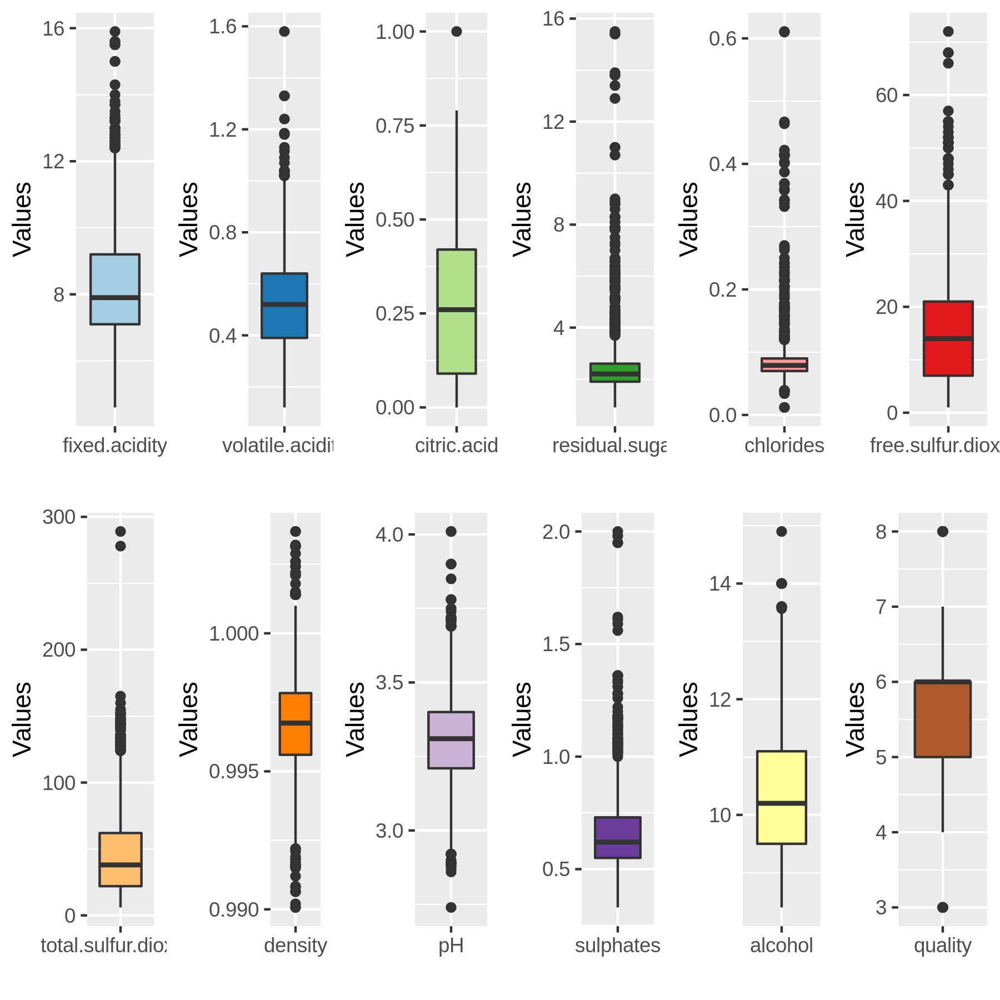

We observe that on making individual box plots, that chlorides and
residual sugar have the most outliers followed by fixed acidity, sulphur
di-oxide and total-sulphur di-oxide. The outliers in density was
suggests that it might have higher variance. Citric acid, Ph and alcohol
have done not show much outliers and are well within their quartiles.

The graph also shows the range of values which varies from around 0-16
for fixed acidity, residual sugars, and alcohol. While for pH it varies
from 2.5 to 4 suggesting at wine are acidic in nature. Density around
0.99 to above 1 suggest that wine can be little lighter or heavier than
the water.

## Correlation Matrix

Figure 2: Plot of
correlation matrix (Heat Map)

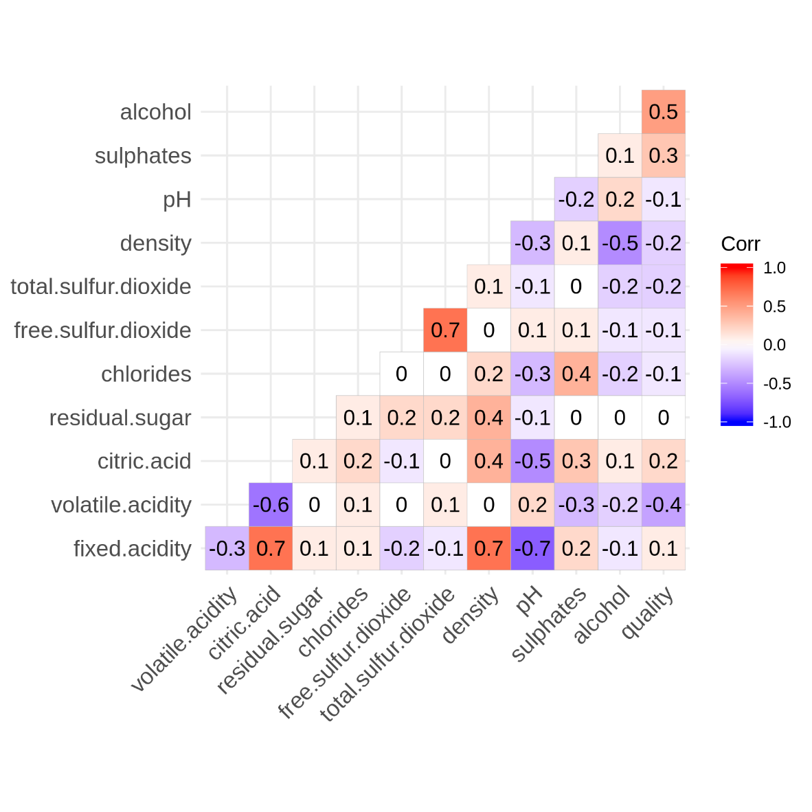

Until now we investigated all the parameters individually but even by
observing the names of columns, we can deduct that free sulphur di-oxide
is part of total sulphur di-oxide. But this methodology of deduction is
just a baseless opinion.

To help ourselves form calculated opinion about relation between data we
use correlation matrix. We have plotted the correlation matrix in
coloured format for easier interpretation.

Alcohol may improve wine quality as it is positively correlated with
quality Citric acid reduces volatile acidity of wine as it is negatively
correlated. Alcohol content decreases density of wine as alcohol is
negative correlated to density.

We observe that:

1.  Fixed acidity (and citric acid) and pH are negatively correlated as
    we know that pH is measure of acidity.

Fixed acidity is highly positively correlated with citric acid and
density.

While free sulphur di-oxide is highly positively correlated with total
sulphur di-oxide.

## Multivariant Box Plot

Now that we know how data may be corelated, but still we do no achieve
our objective of finding what increases the quality of wine. So, we
start with plotting all the parameters individually with respect to
quality as we are interested only in the contributions of
parameters/components to quality of wine. We have 6 level of quality
thus we draw 6 box plots for column with respect to quality. This plot
is more helpful than simple frequency distribution.

Figure 3: Multi Variant
Plot Fixed Acidity vs Quality

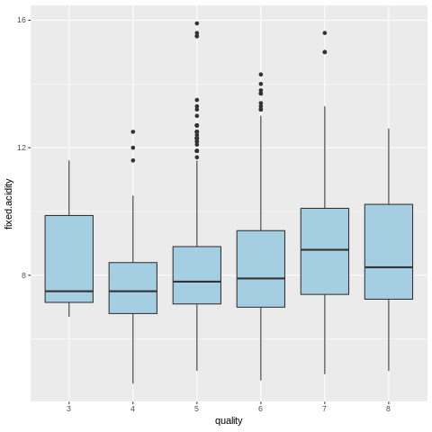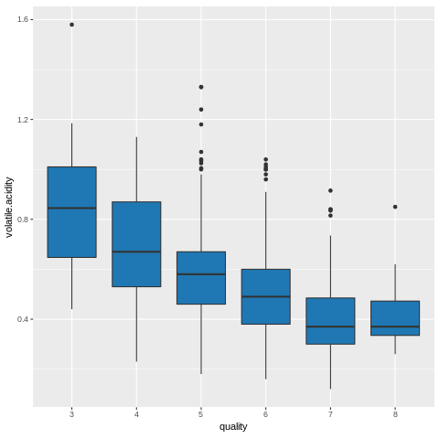

Figure 4: Multi Variant
Plot Volatile Acidity vs Quality

High quality wine contains less volatile acidity while fixed acidity
decreases for low quality wine and increases for high quality wine.

Figure 5: Multi Variant
Plot Citric Acidity vs Quality

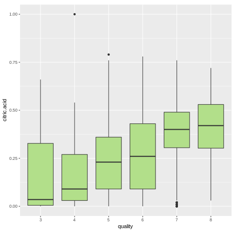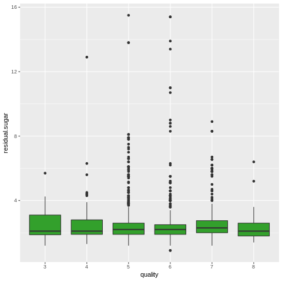

Figure 6: Multi Variant
Plot Residual Sugar vs Quality

High quality wine has more citric acid while residual sugar in wine
remains same for almost every quality of wine.

Figure 7: Multi Variant
Plot Chlorides vs Quality

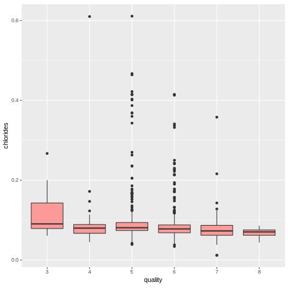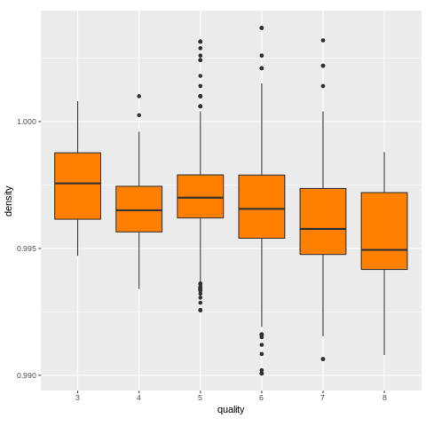

Figure 8: Multi Variant
Plot Density vs Quality

Chlorides shows less fluctuations in value, in high quality wine. High
quality wine is lighter in density compared to water.

Figure 9: Multi Variant
Plot Free S02 vs Quality

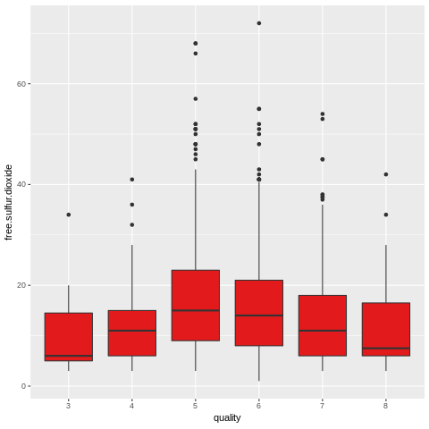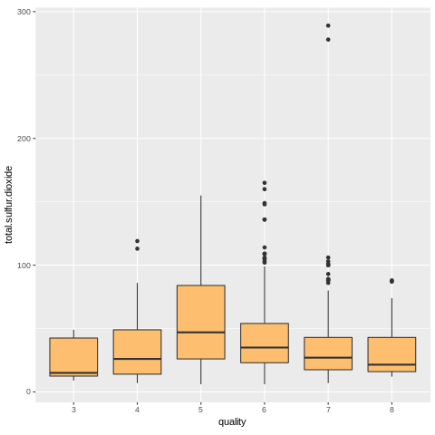

Figure 10: Multi Variant
Plot Total S02 vs Quality

Both sulphur-di oxide and free sulphur di-oxide are showing similar type
of presence per wine quality, suggesting a very high correlation between
them.

Figure 11: Multi Variant
Plot pH vs Quality

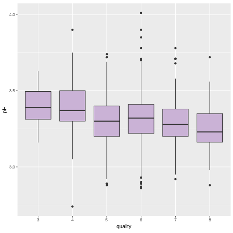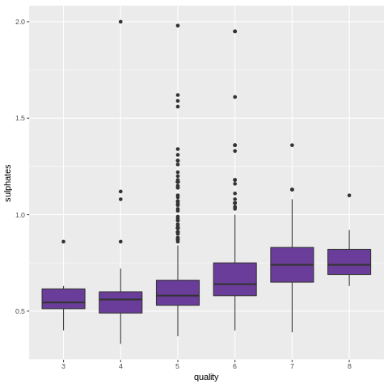

Figure 12: Multi Variant
Plot Sulphates vs Quality

High quality wine is more acidic and contains more sulphates.

Figure 13: Multi Variant
Plot Alcohol vs Quality

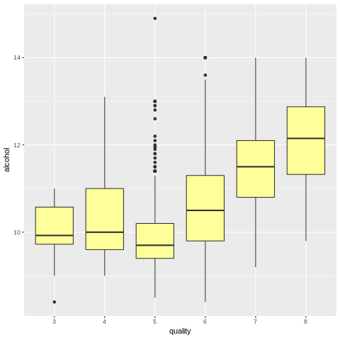

High quality wine has higher alcohol contents.

## Kernel Density Graph

Kernel density graphs are basically a histogram with smoothing. They
help us find if any independent variable is normally distributed.

Figure 14: Kernel Density
Graph

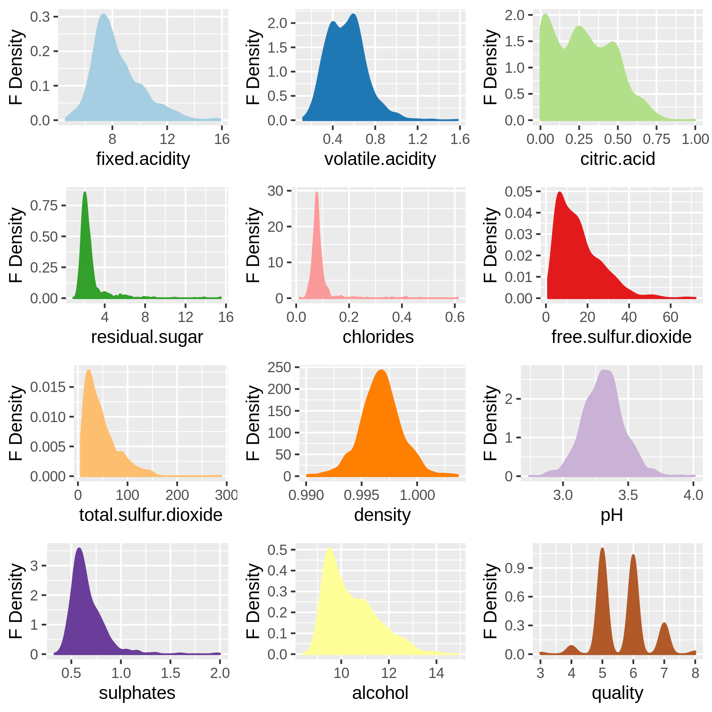

We see from above that only Ph and density are normally distributed
while the rest of independent variable are skewed mostly in towards
left. Thus, they have lower frequency in case of concentrations is high.

## Pair Plots

Until now we compared various parameters with only quality and ignored
that parameter can be compared between themselves for any linear
relations. Thus, we make a scatter plot between all possible combination
of column in data frame to deduct any relationship which may exist
between columns of data.

Figure 15: Pair Plot

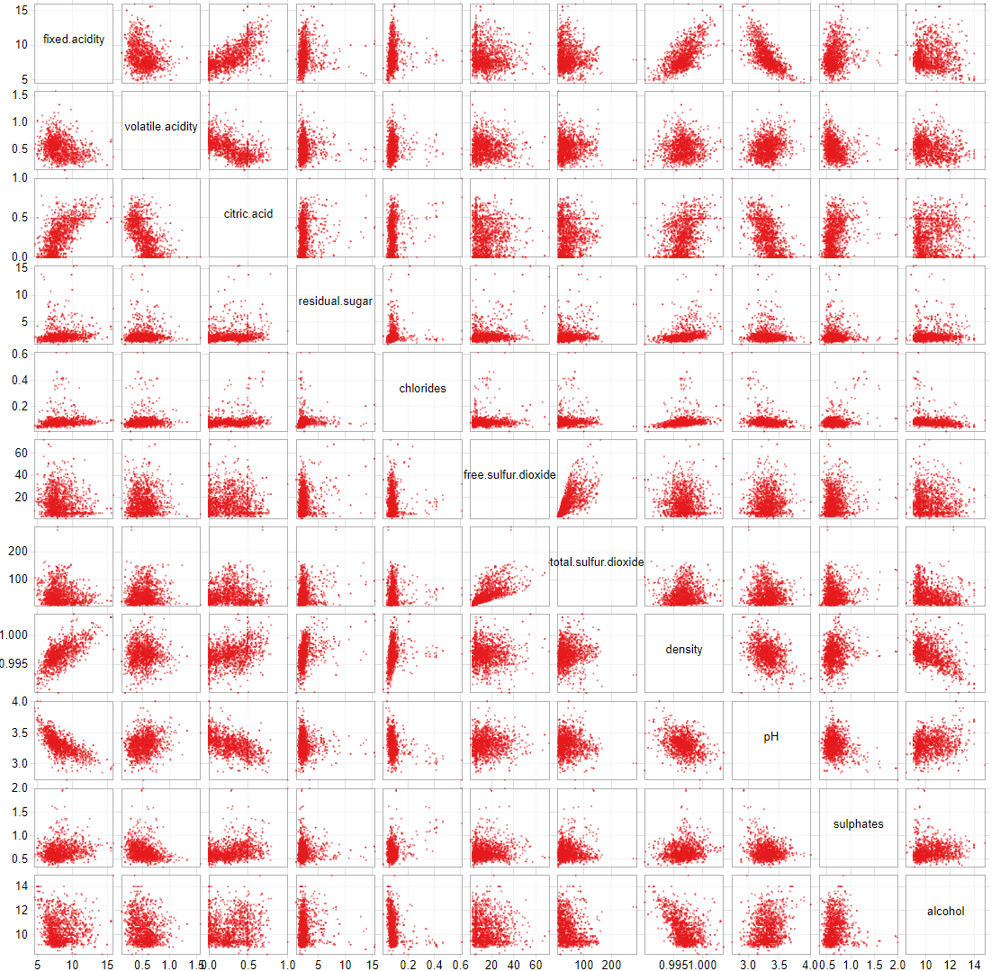

Fixed acidity is directly proportional to citric acid and density while
inversely proportional to PH. Citric acid reduces volatile acidity of
wine. Residual sugar and chlorides are unaffected by any components of
wine. Free sulphuric acid and total sulphuric acid are directly
proportional to each other. Fixed acidity increased the density of wine.
Alcohol content reduces the density of wine and are affected by citric
acid

## Principal Component Analysis (PCA)

PCA helps us find principal components of data namely: the directions
where there are most variance & the directions where the data is most
spread out.

Of all the observation we did until now, we could not reduce the amount
of column in dataset so that we can remove columns not important to us.
PCA analysis not only helps in removing the unnecessary dimensions but
also summarise all our previous observation more clearly. Vectors which
are near to each other are correlated and those along quality increases
the quality, higher the length of vector, higher is the variation
explained by it for the data.

Table 3: PRCOMP Output (PCA
Analysis)

|      | Standard deviation | Proportion of Variance | Cumulative Proportion |
| ---- | ------------------ | ---------------------- | --------------------- |
| PC1  | 1.766682682        | 0.2601                 | 0.2601                |
| PC2  | 1.497291569        | 0.18682                | 0.44692               |
| PC3  | 1.297273946        | 0.14024                | 0.58716               |
| PC4  | 1.102279852        | 0.10125                | 0.68842               |
| PC5  | 0.986541241        | 0.08111                | 0.76952               |
| PC6  | 0.813997693        | 0.05522                | 0.82474               |
| PC7  | 0.786331862        | 0.05153                | 0.87626               |
| PC8  | 0.711247185        | 0.04216                | 0.91842               |
| PC9  | 0.641332626        | 0.03428                | 0.9527                |
| PC10 | 0.572642466        | 0.02733                | 0.98002               |
| PC11 | 0.424521647        | 0.01502                | 0.99504               |
| PC12 | 0.243962942        | 0.00496                | 1                     |

The above table of prcomp tells us that 26% of the variance in the
quality can be explained by one component and 18% of variation by
another component. After which two components can explain around 14% &
10% respectively. The component from PC5 TO PC11 does not add up too
much of explanation of main data.

But this data does not tell us which component is repressed by PC1 and
PC2. A better way understands them is by plotting them. Which is done my
autoplot command, as we can see below.

Figure 16: Principal
Component Analysis

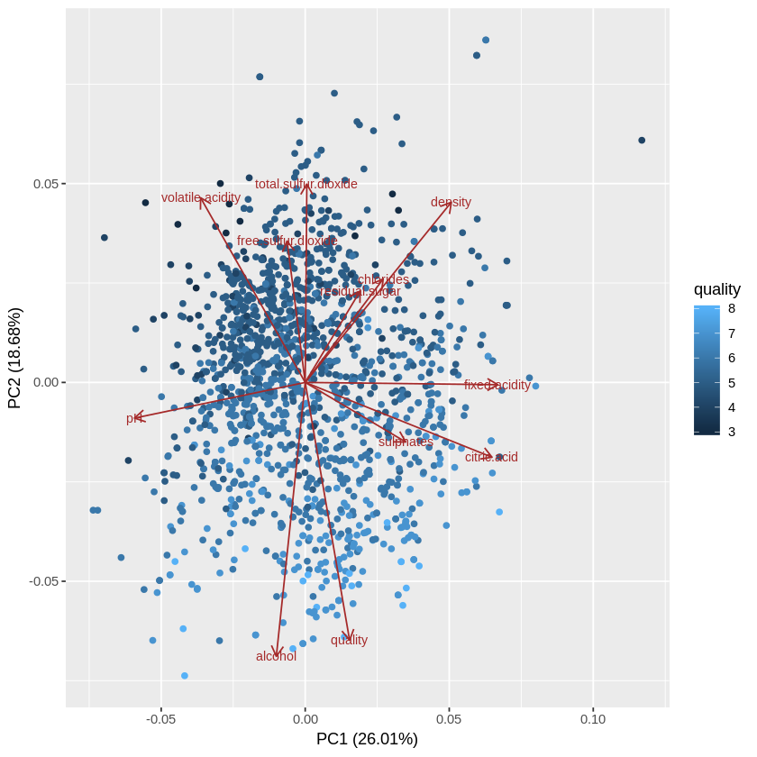

We can now easily conclude that alcohol content increases wine quality
and free-sulphur di-oxide, total sulphur di-oxide, volatile acidity
decreases the quality. Ph and fixed acidity, sulphates and citric acid
are not much of importance. Chlorides, residual sugar and density are
less among the wine of good quality

# Simple Regression

The best tool to make all our suggestion with support of numerical
evidence is regression analysis. As EDA tools have a shortcoming to find
a mathematical equation.

Here we form a mathematical equation after performing regression on the
data.

Table 4: Regression
Coefficient

|                      | Estimate | Std. Error | t value  | Pr(\>|t|)   |
| -------------------- | -------- | ---------- | -------- | ----------- |
| (Intercept)          | 21.9652  | 21.1946    | 1.03636  | 0.300192136 |
| fixed.acidity        | 0.02499  | 0.02595    | 0.96308  | 0.335652752 |
| volatile.acidity     | \-1.0836 | 0.1211     | \-8.9478 | 9.87E-19    |
| citric.acid          | \-0.1826 | 0.14718    | \-1.2404 | 0.214994246 |
| residual.sugar       | 0.01633  | 0.015      | 1.0886   | 0.276495961 |
| chlorides            | \-1.8742 | 0.41928    | \-4.4701 | 8.37E-06    |
| free.sulfur.dioxide  | 0.00436  | 0.00217    | 2.00864  | 0.044744951 |
| total.sulfur.dioxide | \-0.0033 | 0.00073    | \-4.4798 | 8.00E-06    |
| density              | \-17.881 | 21.6331    | \-0.8266 | 0.408607897 |
| pH                   | \-0.4137 | 0.1916     | \-2.159  | 0.031001886 |
| sulphates            | 0.91633  | 0.11434    | 8.0143   | 2.13E-15    |
| alcohol              | 0.2762   | 0.02648    | 10.429   | 1.12E-24    |

The null hypothesis of our linear regression is that component have zero
effective coefficient. So, any component with p value less than 0.05
will reject the null hypotheses at 95% significance level.

From above data we see that following terms have substantial evidence to
predict the quality:

1.  Volatile acidity (0.024)

2.  Chlorides (-1.826)

3.  Free sulphur-di-oxide (0.00436)

4.  Total sulphur di-oxide (-0.0033)

5.  Ph (-0.4137)

6.  Sulphates (0.91633)

7.  Alcohol (0.2762)

Thus, our final equation of quality can be given as:

Quality = 0.91Sulphates + 0.27Alcohol + 0.024Volatile Acidity + 0.004
Free Sulphur di- oxide - 0.003Total sulphur di-oxide - 0.41Ph -
1.82Chlorides

# Conclusion 

Finally, we know how to classify wine as good or bad quality without
even tasting it. We can conclude that if someone is measuring components
of wine and finds that sample has more sulphates and alcohol contents
than it is a good wine only if it also has lower amount of Chlorides and
pH. Which means the wine must be more acidic in nature as acid have
lower pH. We learn form correlation matrix that fixed acidity increases
density while alcohol decreases density of wine.

We also come to know that wine must posses little volatile acidity and
free sulphur-di-oxide, but at same time lower total sulphur-di-oxide.

# Future recommendation

Our adjusted R square for the model was .35 which is very low as we did
not remove the variables with higher correlation and others which do not
contribute enough to our model even after having evidence from PCA
analysis. We can remove those variables from our model and re-run
regression to get higher adjusted R square for model.
